# Access Azure Database for MySQL using Managed Identities in WebLogic Server deployed on Azure

In this sample, you can learn how to configure a Jakarta EE application to use Azure AD credentials, such as Managed Identities, to access Azure Database for MySQL. You will also learn how to setup the Data source in WebLogic. It requires to deploy some modules in the server to be able to use the credential free authentication plugin.

This is a general Java EE (Jakarta EE) application. In the project, we used following technologies of Java EE.


* `JAX-RS (JavaTM API for RESTful Web Services)` 
* `JPA (JavaTM Persistence API)`
* `CDI`
* `JSON-B (JavaTM API for JSON Binding)`


### Prerequire for this sample

* Java SE 8 (or 11)
* Azure CLI command
* Azure Subscription
* git command
* Maven command
* MySQL client command
* Bash
* pwgen as password generator

## Azure Setup
To deploy this samples it is necessary to deploy the first WebLogic Server on Azure and the Azure Database for MySQL. 

To be able to use Azure AD authentication in WebLogic server it is necessary to deploy the authentication library in the server domains that will use this authentication method and also the MySQL JDBC community driver.

To deploy an application using Azure AD credentials:

* Create a user defined managed identity in Azure. In this scenario, when a VM can host multiple applications, using a system assigned identity is not a good idea, as all the applications will share the same identity. For this reason, a user defined identity is recommended.
* Assign the identity to the WebLogic Server Virtual Machine. If you run WebLogic in a cluster, you need to assign the identity to all the VMs that are part of the cluster.
* Create a user in Azure Database for MySQL using the managed identity appId/clientId.
* Create a Data Source in WebLogic Server, using the user defined managed identity.
* Deploy the application in WebLogic Server, referencing the existing Data Source. It is recommended that the application doesn't deploy the Data Source, as it could impersonate another application just by knowing the managed identity clientId.

### Deploy WebLogic Server

This sample assumes that WebLogic Server was deployed using any of the available solutions described [here](https://docs.microsoft.com/azure/virtual-machines/workloads/oracle/oracle-weblogic). For this sample it was deployed using [Oracle WebLogic Server with Admin Server](https://docs.microsoft.com/azure/virtual-machines/workloads/oracle/oracle-weblogic#oracle-weblogic-server-with-admin-server).

It is not the purpose of this sample to explain all the instructions for each of the available offerings. Some of the offerings don't provide the Administrator Server and may require to perform some of the steps using other tools instead of the portal as it is shown in this sample.

#### Deploy using the available templates
As mentioned above, in this sample it is used the [Oracle WebLogic Server with Admin Server](https://docs.microsoft.com/azure/virtual-machines/workloads/oracle/oracle-weblogic#oracle-weblogic-server-with-admin-server) template. To deploy it on azure just open the following link: https://portal.azure.com/#create/oracle.20191009-arm-oraclelinux-wls-admin20191009-arm-oraclelinux-wls-admin. It will open the Azure portal.

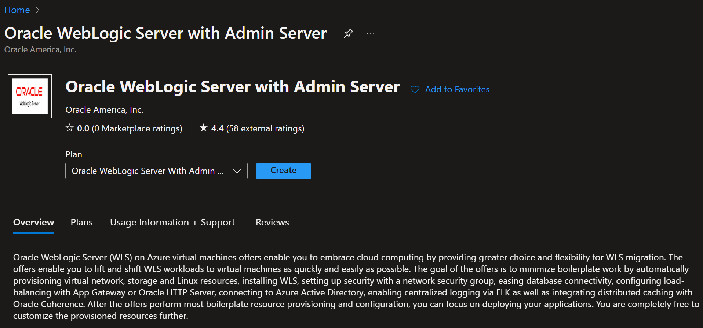

When the template is started it ask for some parameters:


Select the region where you want to deploy the server. In this sample only remark the following parameters:
* The resource group. Take note of the name of the resource group, as the rest of resources will be deployed in the same group.
* The Oracle WebLogic image. It is used the __WebLogic 14.1.1.0.0 with JDK8__ in Oracle Linux.
* The authentication type to access the VM is password. Take note of the password, as it will be necessary to access the VM.
* The WebLogic administrator credentials, as it will be necessary to access the portal to configure the Data Source and deploy the application.

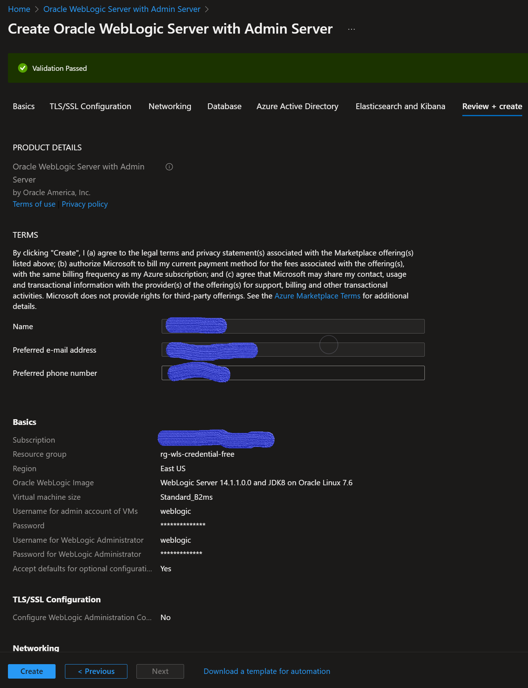

Once deployed, the resource group will look like this:
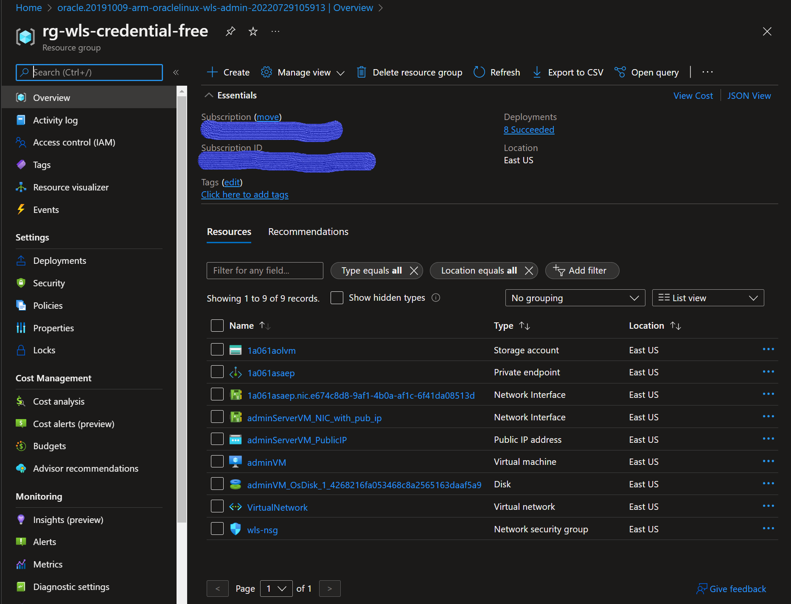

It is necessary to install MySQL Community Driver in the server and also the credential-free authentication plugin. But it will be done [later](#deploy-mysql-server-community-plugin-and-credential-free-authentication-plugin) in this document as there is not yet a MySQL server and a Managed Identity available to validate the installation.

### Deploy Azure Database for MySQL

The following steps are required to setup Azure Database for MySQL and create a user defined managed identity to access a database. All the steps can be performed in Azure CLI
For simplicity there are some variables defined.

```bash
# For simplicity, everything is deployed in the same resource group of the VM. The resource group should exist before running this script.
RESOURCE_GROUP=[SET HERE THE RESOURCE GROUP CREATED FOR THE VM]
# WLS server name that should be already deployed
VM_NAME=[SET HERE THE NAME OF THE WLS VM]

APPLICATION_NAME=checklistapp

MYSQL_HOST=[YOUR PREFERRED HOSTNAME OF THE MYSQL SERVER]
DATABASE_NAME=checklist
DATABASE_FQDN=${MYSQL_HOST}.mysql.database.azure.com
LOCATION=[YOUR PREFERRED LOCATION]
```

#### login to your subscription

```bash
az login
```
#### create mysql server

It is created with an administrator account, but it won't be used as it wil be used the Azure AD admin account to perform the administrative tasks.

```bash
MYSQL_ADMIN_USER=azureuser
# Generating a random password for the MySQL user as it is mandatory
# mysql admin won't be used as Azure AD authentication is leveraged also for administering the database
MYSQL_ADMIN_PASSWORD=$(pwgen -s 15 1)
# create mysql server
az mysql server create \
    --name $MYSQL_HOST \
    --resource-group $RESOURCE_GROUP \
    --location $LOCATION \
    --admin-user $MYSQL_ADMIN_USER \
    --admin-password $MYSQL_ADMIN_PASSWORD \
    --public-network-access 0.0.0.0 \
    --sku-name B_Gen5_1 
```

When creating mysql server, it is necessary to create an Azure AD administrator account to enable Azure AD authentication. The current azure cli user will be configured as Azure AD administrator account.

To get the current user required data:

```bash
CURRENT_USER=$(az account show --query user.name -o tsv)
CURRENT_USER_OBJECTID=$(az ad user show --id $CURRENT_USER --query id -o tsv)
```

Also note the current user domain

```bash
CURRENT_USER_DOMAIN=$(cut -d '@' -f2 <<< $CURRENT_USER)
```

Then, create the Azure AD administrator account:

```bash
# create mysql server AAD admin user
az mysql server ad-admin create --server-name $MYSQL_HOST --resource-group $RESOURCE_GROUP --object-id $CURRENT_USER_OBJECTID --display-name $CURRENT_USER
```

Create a database for the application

```bash
# create mysql database
az mysql db create -g $RESOURCE_GROUP -s $MYSQL_HOST -n $DATABASE_NAME
```

#### Create a user defined managed identity

```bash
# User assigned managed identity name
APPLICATION_MSI_NAME="id-${APPLICATION_NAME}"
# Create user assignmed managed identity
az identity create -g $RESOURCE_GROUP -n $APPLICATION_MSI_NAME
# Assign the identity to the VM
az vm identity assign --resource-group $RESOURCE_GROUP --name $VM_NAME --identities $APPLICATION_MSI_NAME
```

#### Service connection creation

Service connection with managed identities is not supported for Virtual Machines. All required steps will be performed manually. To summarize, the steps are:

1. Create a temporary firewall rule to allow access to the mysql server. MySQL server was configured to allow only other Azure services to access it. To allow the deployment box to perform action on MySQL it is necessary to open a connection. After all actions are performed it will be deleted.
1. Get the user identity. MySQL requires the clientId/applicationId
1. Create a mysql user for the application identity and grant permissions to the database. For this action, it is necessary to connect to the database, for instance using _mysql_ client tool. The current user, an Azure AD admin configured above, will be used to connect to the database. `az account get-access-token` can be used to get an access token.
1. Remove the temporary firewall rule.

Note: The database tables will be created taking advantage of the temporary firewall rule
```bash
# 0. Create a temporary firewall rule to allow connections from current machine to the mysql server
MY_IP=$(curl http://whatismyip.akamai.com)
az mysql server firewall-rule create --resource-group $RESOURCE_GROUP --server $MYSQL_HOST --name AllowCurrentMachineToConnect --start-ip-address ${MY_IP} --end-ip-address ${MY_IP}
# 1. Get user defined managed clientId
APPLICATION_IDENTITY_APPID=$(az identity show -g ${RESOURCE_GROUP} -n ${APPLICATION_MSI_NAME} --query clientId -o tsv)
# 2. Create mysql user in the database and grant permissions the database. Note that login is performed using the current logged in user as AAD Admin and using an access token
RDBMS_ACCESS_TOKEN=$(az account get-access-token --resource-type oss-rdbms --output tsv --query accessToken)
mysql -h "${DATABASE_FQDN}" --user "${CURRENT_USER}@${MYSQL_HOST}" --enable-cleartext-plugin --password="$RDBMS_ACCESS_TOKEN" << EOF 
SET aad_auth_validate_oids_in_tenant = OFF;

DROP USER IF EXISTS '${APPLICATION_LOGIN_NAME}'@'%';

CREATE AADUSER '${APPLICATION_LOGIN_NAME}' IDENTIFIED BY '${APPLICATION_IDENTITY_APPID}';

GRANT ALL PRIVILEGES ON ${DATABASE_NAME}.* TO '${APPLICATION_LOGIN_NAME}'@'%';

FLUSH privileges;
EOF

# 3. Create Database tables
mysql -h "${DATABASE_FQDN}" --user "${CURRENT_USER}@${MYSQL_HOST}" --enable-cleartext-plugin --password="$RDBMS_ACCESS_TOKEN" < init-db.sql

# 4. Remove temporary firewall rule
az mysql server firewall-rule delete --resource-group $RESOURCE_GROUP --server $MYSQL_HOST --name AllowCurrentMachineToConnect
```

#### Deployment script
In [deploy.sh](azure/deploy.sh) script you can find the previous steps required to setup the Database and configure the access for the managed identity for the sample application.

### Deploy MySQL Server community plugin and credential-free authentication plugin

At this point, it is possible deploy the required components in WebLogic and creating a Data Source in WebLogic server using the managed identity.

*Note: Most of the steps to deploy the MySQL Community Driver are extracted from the excellent LinkedIn Learning course [Java EE: Application Servers](https://www.linkedin.com/learning/java-ee-application-servers/)*

#### Download MySQL community plugin

Download the MySQL community plugin from [here](https://dev.mysql.com/downloads/connector/j/). For this sample it was used the platform independent version.

You can open a ssh session on WLS Server VM and run the following commands:

```bash
mkdir libs
cd libs
wget https://dev.mysql.com/get/Downloads/Connector-J/mysql-connector-java-8.0.30.tar.gz
tar -xf mysql-connector-java-8.0.30.tar.gz
```

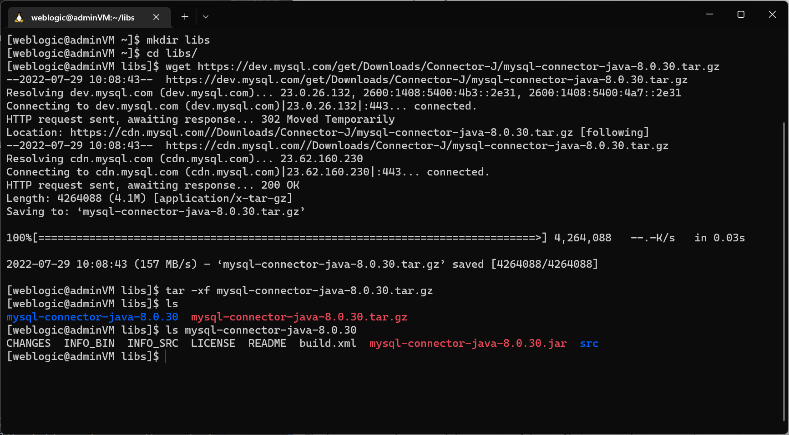

The last command extracted the content of the tar file into mysql-connector-java-8.0.30 folder. That folder contains the MySQL community plugin jar file among other files. As only the jar file will be required, it is possible to move it to libs folder and remove the rest of the files and folders.

```bash
mv mysql-connector-java-8.0.30/mysql-connector-java-8.0.30.jar .
rm -rf mysql-connector-java-8.0.30
rm mysql-connector-java-8.0.30.tar.gz
```

At this point, only the MySQL community plugin jar file should be in libs folder.

#### Copy the credential free authentication plugin to the WLS Server VM

TODO: THIS SECTION NEEDs TO BE UPDATED WITH LAST VERSION OF THE PLUGIN. Will be described assuming the current home made version of the plugin.

Copy the shade version of the authentication plugin jar file to the WLS Server VM, in libs folder. You can use scp for that purpose.

```bash
scp credential-free-jdbc-0.0.1-SNAPSHOT.jar weblogic@<wls-server-address>:/home/weblogic/libs
```

Now both the MySQL community plugin and the credential free authentication plugin are in the WLS Server VM, in /home/weblogic/libs folder.

*Note: weblogic is the default user created by the offering template. If it was used a different parameter this path may change.*

#### Install the MySQL community driver and the credential free authentication plugin

The installation consists of the following steps:

* Copy the MySQL community driver jar file and the credential-free authentication plugin jar file into the WebLogic modules folder. To avoid conflicts with the installed commercial version of the driver, it is necessary to move the commercial version to a different folder.
* Configure the WebLogic domain classpath to find the new modules. If this step is not performed, the new modules will not be found.

##### Copy the MySQL community driver jar file to the WebLogic modules folder

The default WebLogic server location is /u01. And the modules is located in /u01/app/wls/install/oracle/middleware/oracle_home/oracle_common/modules .To perform the following action it is required elevated mode, so the first step will be to make a _sudo su_ command.

```bash
sudo su
```

First move the existing version of the driver to a different folder. For this it is necessary to locate first the exact folder.

```bash
cd /u01/app/wls/install/oracle/middleware/oracle_home/oracle_common/modules
ls | grep mysql
```

The last command will return the name of the folder containing the MySQL driver. 
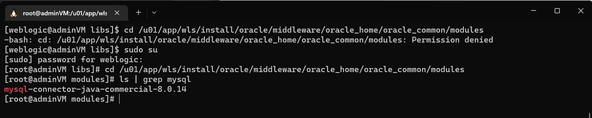
In this case mysql-connector-java-commercial-8.0.14. So now, let's move the driver to a different folder, for instance bak_mysql-connector-java-commercial-8.0.14.

```bash
mv mysql-connector-java-commercial-8.0.14 bak_mysql-connector-java-commercial-8.0.14
```

Now copy both MySQL community driver jar file and the credential-free authentication plugin jar file to the WebLogic modules folder.

```bash
cp /home/weblogic/libs/*.jar .
```

Now it is necessary to configure the WebLogic domain classpath to find the new modules. For that purpose go the WebLogic domain folder to configure. In the case the adminDomain. The default root folder for domains created by the template is /u01/domains, then the adminDomain will be located in /u01/domains/adminDomain. Then go to the bin folder and edit the setDomainEnv.sh file. In this sample it is used nano, but you can use any text editor.

```bash
cd /u01/domains/adminDomain/bin
nano setDomainEnv.sh
```

Look for WL_HOME definition and add the following lines before WL_HOME.
```
# Set credential free dependencies in the class path
CLASSPATH="/u01/app/wls/install/oracle/middleware/oracle_home/oracle_common/modules/mysql-connector-java-8.0.30.jar:/u01/app/wls/install/oracle/middleware/oracle_home/oracle_common/modules/credential-free-jdbc-0.0.1-SNAPSHOT.jar:${CLASSPATH}"
```

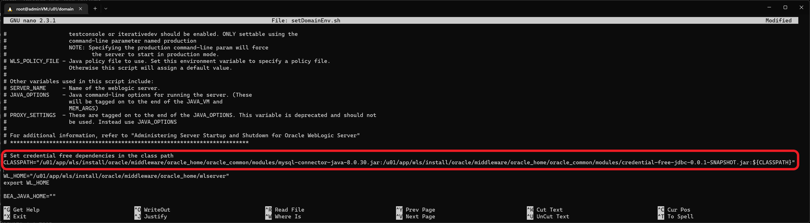

It adds the MySQL community driver and the credential-free authentication plugin jar file to the class path.

Now save the file and close it.

To apply the changes, it is necessary to restart the WebLogic server. For simplicity, to do that the full VM will be restarted. In production systems it can be done by restarting the domain only.

```bash
reboot
```

#### Configure the Data Source in WebLogic

The following steps will be performed in the WebLogic server administrator portal. It can be accessed on http://<wls-server-address>:7001/console. The address can be found in the Azure portal.

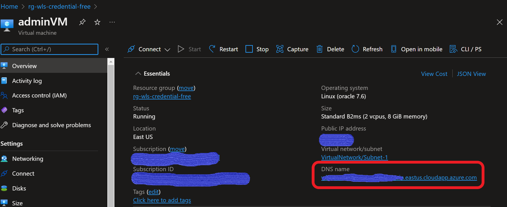

The credentials for the administrator were defined in the deployment template.

Go to Data Sources and create a new Data Source.

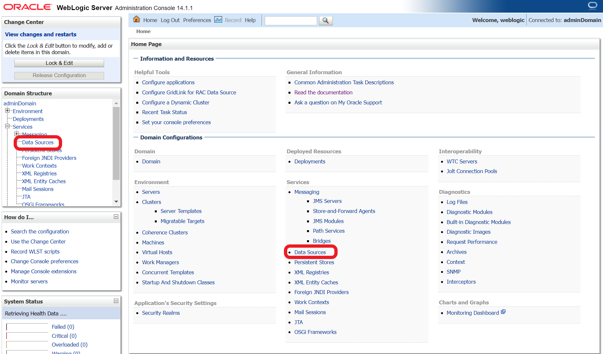

To allow updates in the domain it is necessary to click on "Lock & Edit" button.

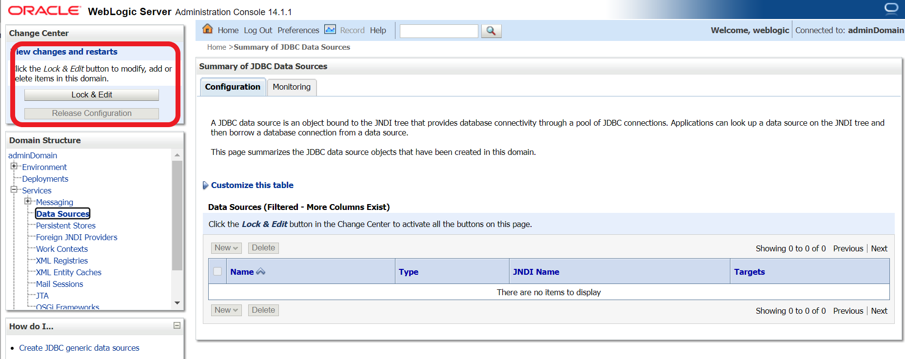

Now create a new generic data source.

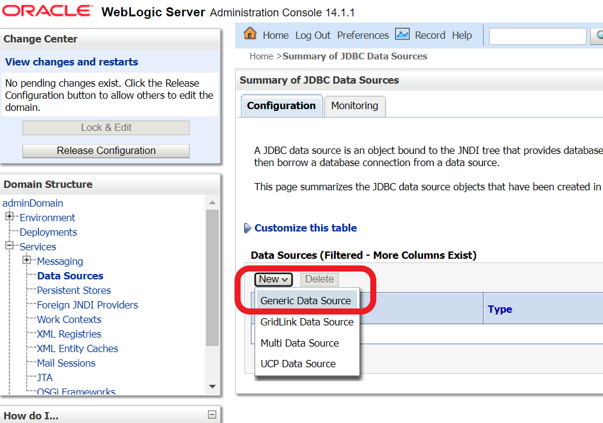

Set the name of the data source to credential_free and most important, the JNDI name to jdbc/credential_free. This name will be referenced in the application to deploy. Set the database type to MySQL.

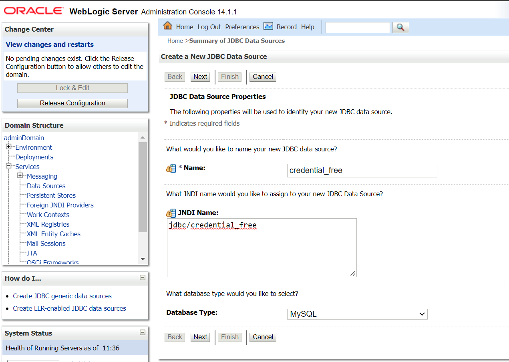

Then click next. In the following screen select the database driver. In this case select com.mysql.**cj**.jdbc.Driver.
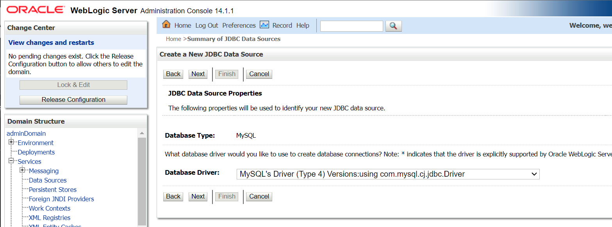

The following page can be set with the default values.

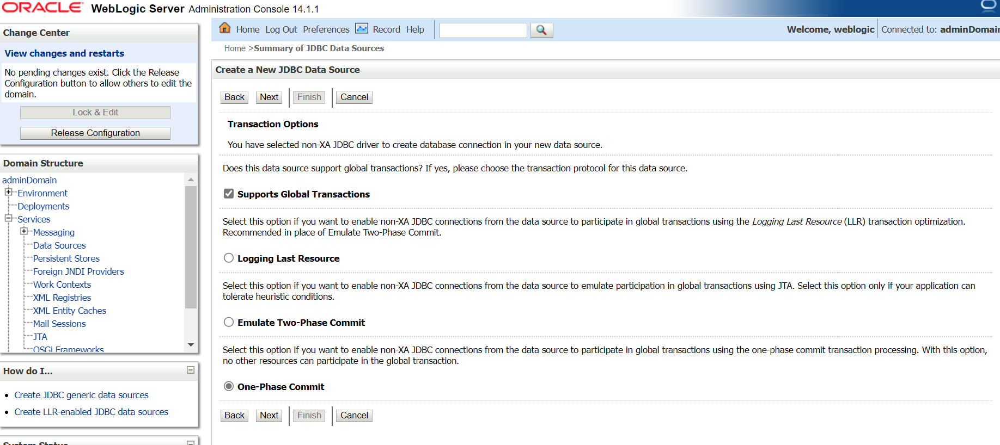

Then in the connection properties, set the database and hostname created previously. The port should be 3306 and the user name should be the user created previously. 

The user will look like applicationname@mydomain.onmicrosoft.com@mysqlhost.

Important: Keep the password empty :)

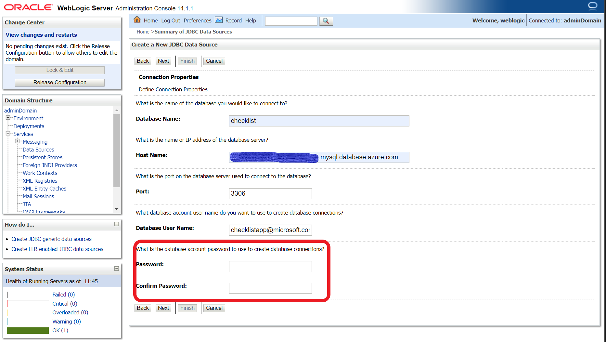

In the last screen, it is necessary to specify some additional parameters on the JDBC url. It should look like this:
```
jdbc:mysql://<mysql host>.mysql.database.azure.com:3306/checklist?useSSL=true&requireSSL=true&defaultAuthenticationPlugin=com.azure.jdbc.msi.extension.mysql.AzureMySqlMSIAuthenticationPlugin&authenticationPlugins=com.azure.jdbc.msi.extension.mysql.AzureMySqlMSIAuthenticationPlugin&clientid=<managed identity client id>
```

* useSSL and requireSSL are set to true. When using Azure AD authentication, the password sent is an OAuth access token. The token is sent just an encoded string that can be easily decoded. For that reason, it is necessary to enforce the use of SSL.
* defaultAuthenticationPlugin and authenticationPlugins are a mechanism to customize the authentication process on JDBC connections. This plugin is the one registered previously in WebLogic Server and it is responsible to get an access token from the Azure AD to access the database.
* clientid is the clientId of the Managed Identity. If no clientId is specified, the default managed identity will be the system one. In local environments it is possible to use the Azure cli logged-in user or IDE user (for Visual Studio, Visual Studio Code and IntelliJ)

Here an example of the JDBC url:

```
jdbc:mysql://thegreataadauthdb.mysql.database.azure.com:3306/checklist?useSSL=true&requireSSL=true&defaultAuthenticationPlugin=com.azure.jdbc.msi.extension.mysql.AzureMySqlMSIAuthenticationPlugin&authenticationPlugins=com.azure.jdbc.msi.extension.mysql.AzureMySqlMSIAuthenticationPlugin&clientid=d36a3bbf-3494-448d-807e-ee936847ad2f
```

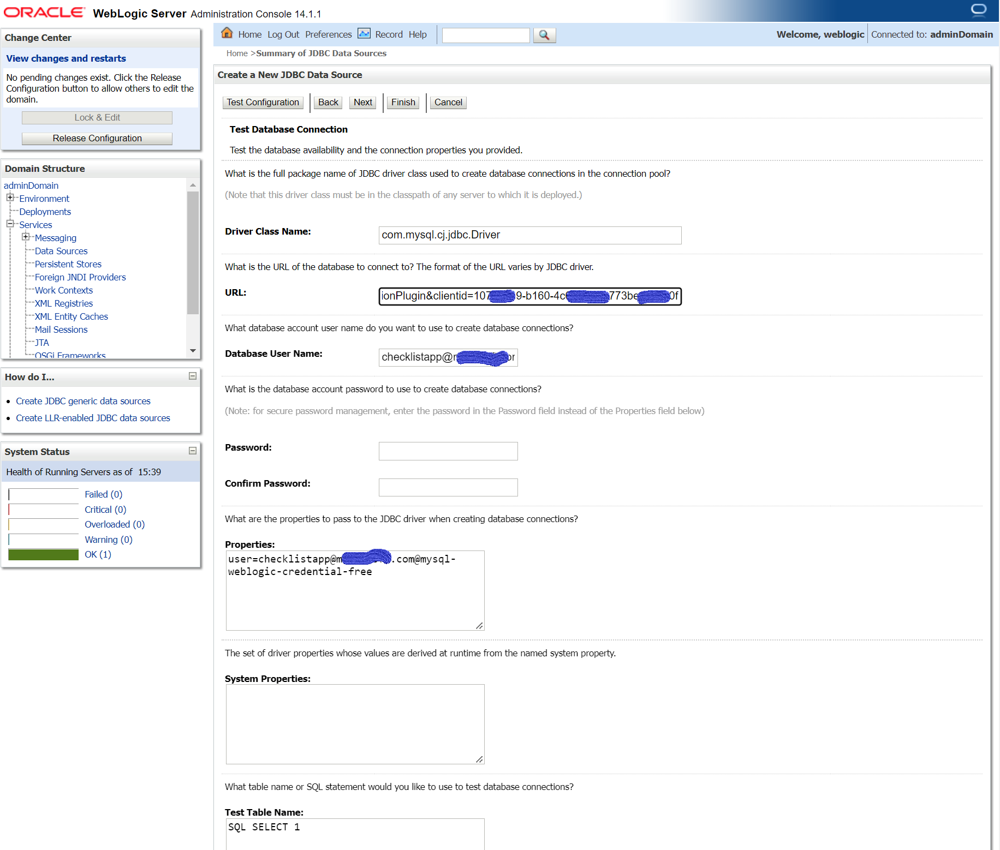

And then finally test the connection by clicking on "Test Configuration" button. If everything is ok you will see a message saying "Connection test succeeded."

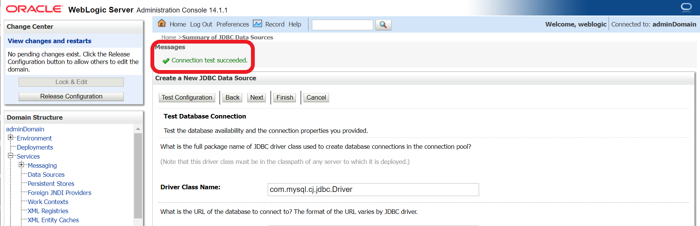

Click "Next" to select the target to deploy the data source. In this case "admin".

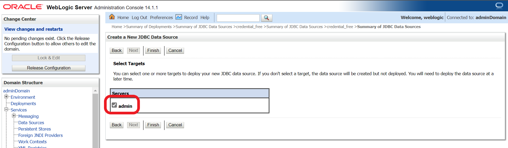

Now click "Finish" button, and to make the data source available in the domain click on "Activate Changes" button.

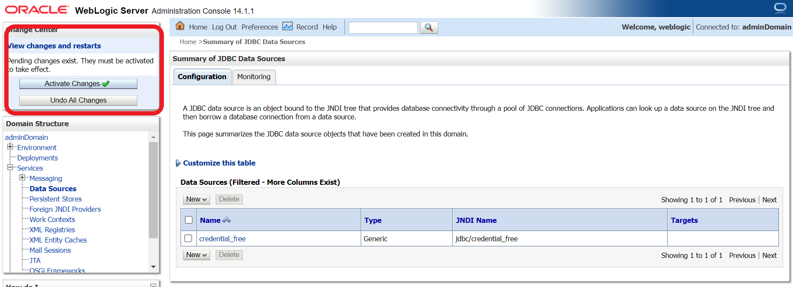

A message like "All changes have been activated. No restarts are necessary" will be displayed.

Now this Data Source is available to be used in the hosted applications. In the following steps will be demonstrated how to reference this data source in the application to deploy.

### Deploy the application

As mentioned during the data source creation, the application deployment should reference the data source created previously. To do that, go to WEB-INF folder and open web.xml file. It should look like this:

```xml
<?xml version="1.0" encoding="UTF-8"?>
<web-app xmlns="http://xmlns.jcp.org/xml/ns/javaee" xmlns:xsi="http://www.w3.org/2001/XMLSchema-instance" xsi:schemaLocation="http://xmlns.jcp.org/xml/ns/javaee http://xmlns.jcp.org/xml/ns/javaee/web-app_4_0.xsd" version="4.0">
    ...
    <!-- Reference to an existing datasource created in the application server-->
    <resource-ref>
        <res-ref-name>jdbc/credential_free</res-ref-name>
        <res-type>javax.sql.DataSource</res-type>
        <res-auth>Container</res-auth>
    </resource-ref>
</web-app>
```

Then ensure that the persistence unit references the data source. The persistence unit is defined in persistence.xml file, and it should look like this:

```xml
<?xml version="1.0" encoding="UTF-8"?>
<persistence version="2.2" xmlns="http://xmlns.jcp.org/xml/ns/persistence" xmlns:xsi="http://www.w3.org/2001/XMLSchema-instance" xsi:schemaLocation="http://xmlns.jcp.org/xml/ns/persistence http://xmlns.jcp.org/xml/ns/persistence/persistence_2_2.xsd">
  <persistence-unit name="CredentialFreeDataSourcePU" transaction-type="JTA">
    <jta-data-source>jdbc/credential_free</jta-data-source>
    <exclude-unlisted-classes>false</exclude-unlisted-classes>
    ...
  </persistence-unit>
</persistence>
```

#### Build the application

To build the application, go to the project folder and run the following command:

```bash
mvn clean package
```

It generates a WAR file that is located in the target folder.

#### Deploy the application in WebLogic Server

Open the WebLogic Server Administration Console and go to *Deployments*.

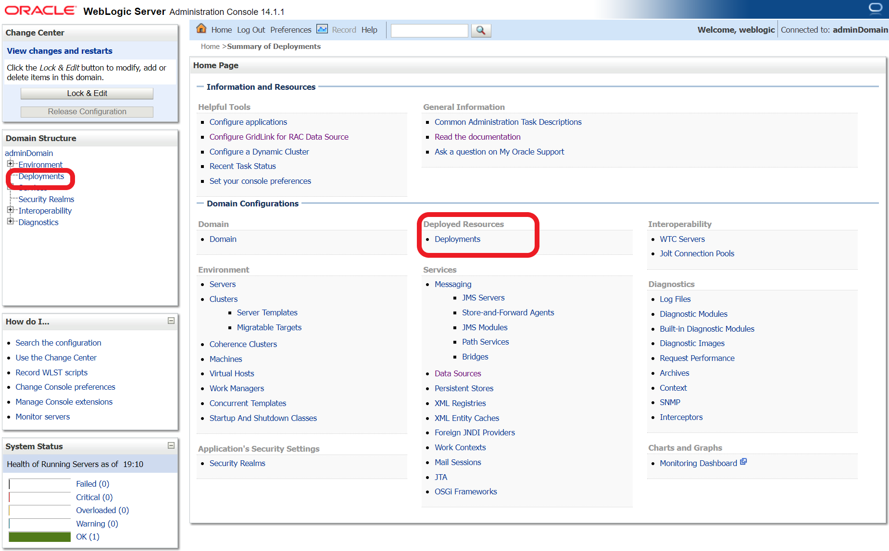

Click on "Lock & Edit" button to start the deployment. And then on "Install" button.

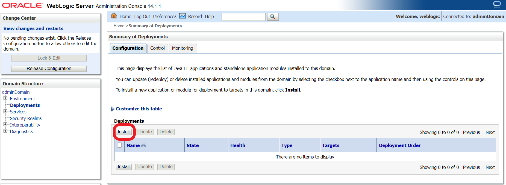

That starts the Install Application Assistant. There is a link that allows to upload the WAR file, click on it.

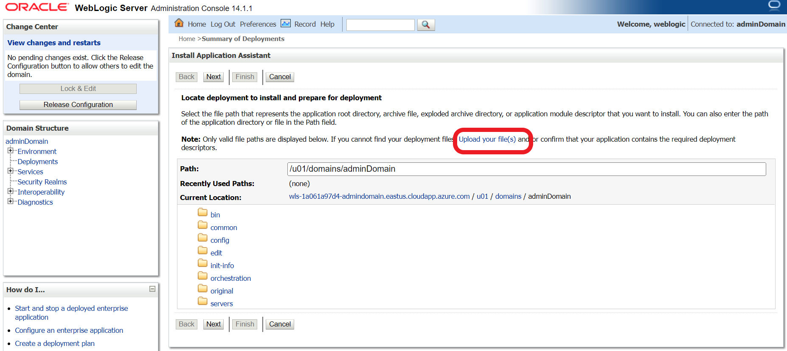

Select the WAR file and click on "Next" button. That will upload the WAR file.

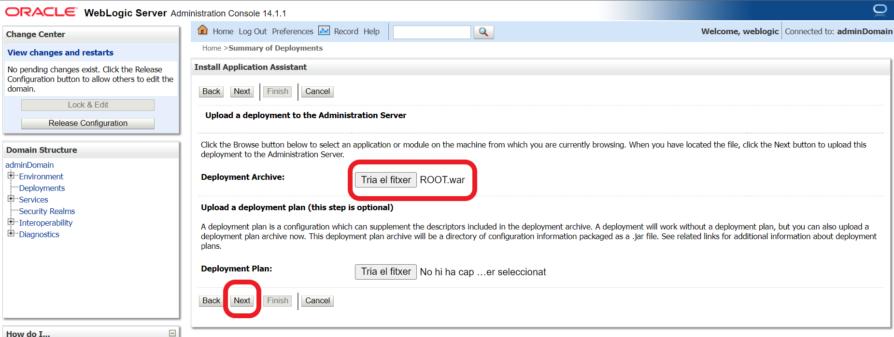

In the next screen click on "Next" button to continue the deployment.


Then click on "Next" button to continue the deployment.

In the next screen, you can choose the installation type. It can be an application or library. Select as an application and click next.

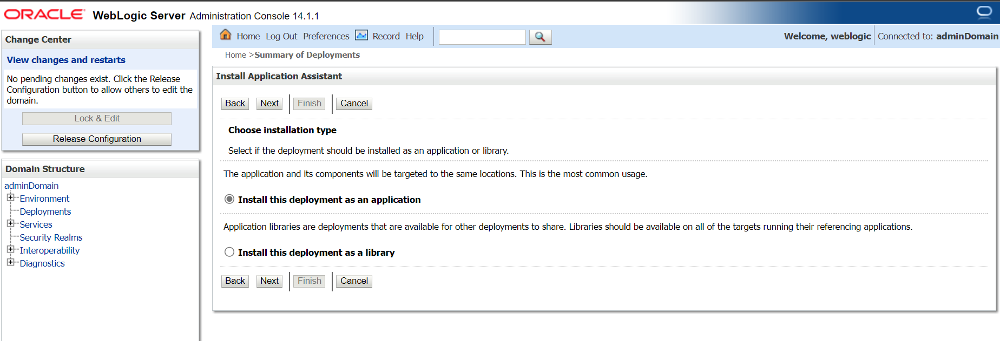

In the following page appears the optional settings. They can be left as they are. Then click "Finish" button.

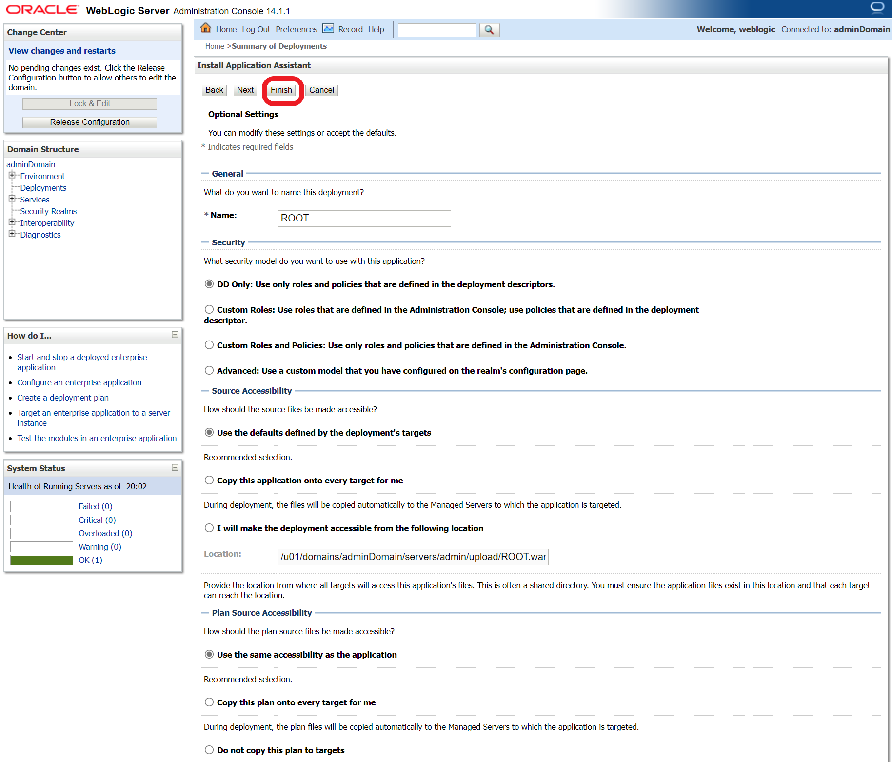

To commit the changes, click in "Activate Changes" button.


Now the application is prepared, but not yet started. To start the application go to *Control* tab, select the deployment and click on "Start" button.

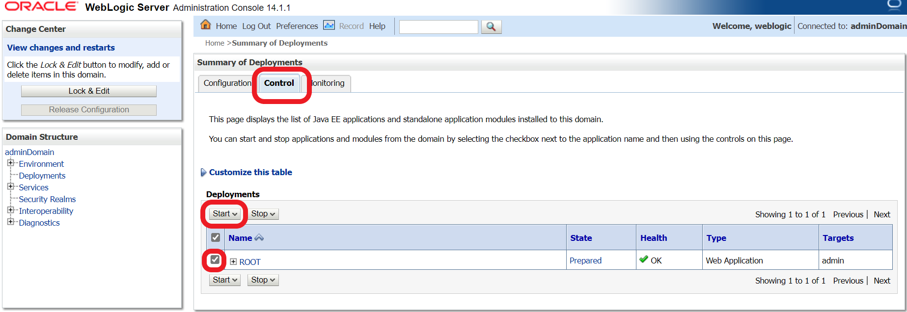

Then confirm by clicking on "Yes" button.

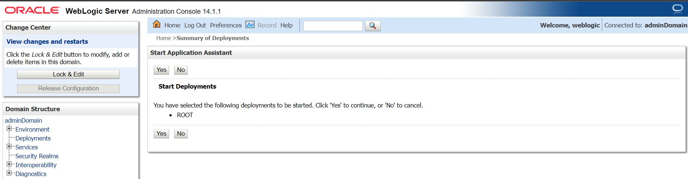

 And the application is started.

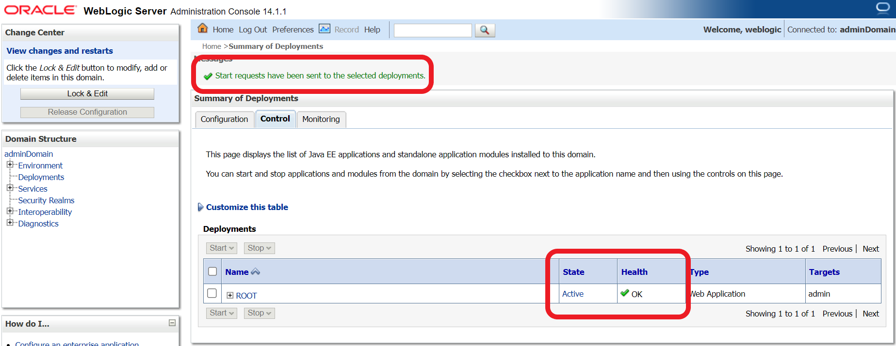

You can execute a curl command to verify the application is running:

```curl -X GET http://<your server>:7001/ROOT/checklist/```
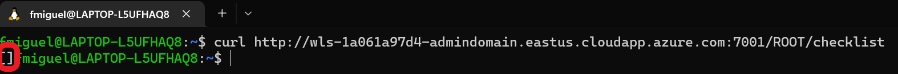

If the database contains no data it just returns an empty array.

There is a [postman collection](./postman/check_lists_request.postman_collection.json) available to test the application.

### Clean-up Azure resources
Just delete the resource group where all the resources were created
```bash
az group delete $RESOURCE_GROUP
```

## Overview of the code

In this project, we will access to MySQL DB from Jakarta EE 8 Application.
To connect to the MySQL from Java, you need implement and configure the project with following procedure.

1. Create and Configure as a Jakarta EE 8 Project
2. Create a reference to the existing Data Source
3. Create a persistence unit config for JPA on persistence.xml
4. Inject EntityManager Instance
5. Implement JAX-RS Endpoint
6. Access to the RESTful Endpoint

### 1. Create and Configure as a Jakarta EE 8 Project

In this project, we created Jakarta EE 8 projects. In order to create the Jakarta EE 8 project, we need specify following dependencies on [pom.xml](pom.xml).

```xml
    <jakarta.jakartaee-api.version>8.0.0</jakarta.jakartaee-api.version>
    ....
    <dependency>
      <groupId>jakarta.platform</groupId>
      <artifactId>jakarta.jakartaee-api</artifactId>
      <version>${jakarta.jakartaee-api.version}</version>
      <scope>provided</scope>
    </dependency>
```

### 2. Create a reference to the existing Data Source

Open the web.xml file and add the following lines:

```xml
    <resource-ref>
        <res-ref-name>jdbc/credential_free</res-ref-name>
        <res-type>javax.sql.DataSource</res-type>
        <res-auth>Container</res-auth>
    </resource-ref>
```

It means that the application assumes that the data source is already created in the hosting environment.
### 3. Create a persistence unit config for JPA on persistence.xml

After reference the existing data source, it is necessary tocreate persistence unit config on [persistence.xml](src/main/resources/META-INF/persistence.xml) which is the configuration file of JPA.

```xml
<?xml version="1.0" encoding="UTF-8"?>
<persistence version="2.2" xmlns="http://xmlns.jcp.org/xml/ns/persistence" xmlns:xsi="http://www.w3.org/2001/XMLSchema-instance" xsi:schemaLocation="http://xmlns.jcp.org/xml/ns/persistence http://xmlns.jcp.org/xml/ns/persistence/persistence_2_2.xsd">
  <persistence-unit name="CredentialFreeDataSourcePU" transaction-type="JTA">
    <jta-data-source>jdbc/credential_free</jta-data-source>
    <exclude-unlisted-classes>false</exclude-unlisted-classes>
    <properties>
      <property name="hibernate.generate_statistics" value="true" />
      <property name="hibernate.dialect" value="org.hibernate.dialect.MySQLDialect" />
    </properties>
  </persistence-unit>
</persistence>
```

### 4. Inject EntityManager Instance

Then you can inject an EntityManager instance from annotated unitName with `@PersistenceContext` like follows.  
In the `CheckListRepository.java` and `CheckItemRepository.java` code, you can see the injected  EntityManager instance with @PersistenceContext annotation.

Following is [CheckListRepository.java](src/main/java/com/azure/samples/repository/CheckListRepository.java) code.

```java
@Transactional(REQUIRED)
@RequestScoped
public class CheckListRepository {

    @PersistenceContext(unitName = "CredentialFreeDataSourcePU")
    private EntityManager em;

    public Checklist save(Checklist checklist) {

        em.persist(checklist);
        return checklist;
    }

    @Transactional(SUPPORTS)
    public Optional<Checklist> findById(Long id) {
        Checklist checklist = em.find(Checklist.class, id);
        return checklist != null ? Optional.of(checklist) : Optional.empty();
    }

    @Transactional(SUPPORTS)
    public List<Checklist> findAll() {
        return em.createNamedQuery("Checklist.findAll", Checklist.class).getResultList();
    }

    public void deleteById(Long id) {
        em.remove(em.find(Checklist.class, id));
    }
}
```

### 5. Implement JAX-RS resource

Finally, you can implement the JAX-RS resource in [CheckListResource.java](src/main/java/com/azure/samples/controller/CheckListResource.java) by injecting the `CheckListService` which implemented in the above.  
And we configured to use the JSON-B in this project, so it automatically marshall the JSON data from Java object. As a result, it return the JSON data in the response.

```java

@Path("/checklist")
public class CheckListResource {

    @Inject
    private CheckListService checkListService;

	
    @GET
	@Produces(MediaType.APPLICATION_JSON)
	public List<Checklist> getCheckLists() {		
		return checkListService.findAll();
	}

    @GET
	@Path("{checklistId}")
	@Produces(MediaType.APPLICATION_JSON)
	public Checklist getCheckList(@PathParam(value = "checklistId") Long checklistId) {
		return checkListService.findById(checklistId).orElseThrow(() -> new ResourceNotFoundException("checklist  " + checklistId + " not found"));
	}

    @POST
    @Produces(MediaType.APPLICATION_JSON)
    public Checklist createCheckList(@Valid Checklist checklist) {
        return checkListService.save(checklist);
    }

    @POST
    @Path("{checklistId}/item")
    @Produces(MediaType.APPLICATION_JSON)
    public CheckItem addCheckItem(@PathParam(value = "checklistId") Long checklistId, @Valid CheckItem checkItem) {
        return checkListService.addCheckItem(checklistId, checkItem);
    }
}
```

### 6. Access to the RESTful Endpoint

The checklist resource is exposed in _/checklist_ path. So you can test it by executing the following command.

```bash
curl http://<your weblogic address>:7001/ROOT/checklist
[{"date":"2022-03-21T00:00:00","description":"oekd list","id":1,"name":"hajshd"},{"date":"2022-03-21T00:00:00","description":"oekd list","id":2,"name":"hajshd"},{"date":"2022-03-21T00:00:00","description":"oekd list","id":3,"name":"hajshd"}]
```

As part of this sample, it is provided a [postman collection](postman/check_lists_request.postman_collection.json) which you can use to test the RESTful API. Just change _appUrl_ variable by your Azure App Service URL.

