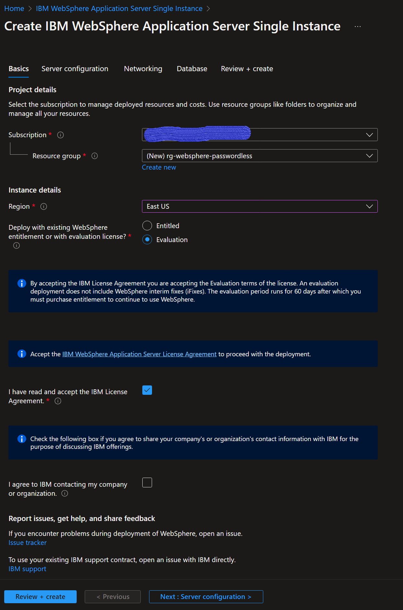
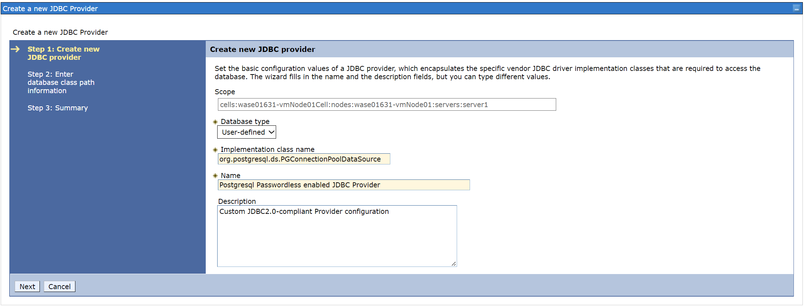
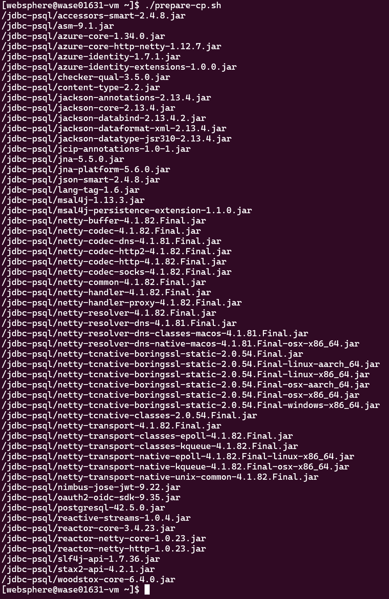

# Access Azure Database for Postgresql using Managed Identities in WebSphere deployed on Azure

In this sample, you can learn how to configure a Jakarta EE application to use Azure AD credentials, such as Managed Identities, to access Azure Database for Postgresql. You will also learn how to setup the Data source in WebSphere. It requires to deploy some modules in the server to be able to use the credential free authentication plugin.

This is a general Java EE (Jakarta EE) application. In the project, we used following technologies of Java EE.


* `JAX-RS (JavaTM API for RESTful Web Services)` 
* `JPA (JavaTM Persistence API)`
* `CDI`
* `JSON-B (JavaTM API for JSON Binding)`


### Prerequire for this sample

* Java SE 8 (or 11)
* Azure CLI command
* Azure Subscription
* git command
* Maven command
* Postgresql client command
* Bash
* pwgen as password generator

## Azure Setup

To deploy this sample, it is necessary to deploy the WebSphere on Azure and the Azure Database for Postgresql Server first.

To be able to use Azure AD authentication in WebSphere server it is necessary to deploy the authentication library in the server domains that will use this authentication method and also the Postgresql JDBC community driver.

To deploy an application using Azure AD credentials:

* Create a user-assigned managed identity in Azure. In this scenario, when a VM can host multiple applications, using a system-assigned managed identity is not a good idea, as all the applications will share the same identity. For this reason, a user-assigned managed identity is recommended.
* Assign the identity to the WebSphere Server Virtual Machine. If you run WebSphere in a cluster, you need to assign the identity to all the VMs that are part of the cluster.
* Create a user in Azure Database for Postgresql using the user-assigned managed identity appId/clientId.
* Create a Data Source in WebSphere Server, using the user-assigned managed identity.
* Deploy the application in WebSphere Server, referencing the existing Data Source. It is recommended that the application doesn't deploy the Data Source, as it could impersonate another application just by knowing the user-assigned managed identity clientId.

### Deploy WebSphere

This sample assumes that WebSphere was deployed using WebSphere Application Server on VMs solution described [here](https://learn.microsoft.com/en-us/azure/developer/java/ee/websphere-family#websphere-application-server-on-vms). For this sample it was deployed using _IBM WebSphere Application Server Single Instance_

#### Deploy using the available templates

To deploy it on azure just open the following [link](https://ms.portal.azure.com/#create/ibm-usa-ny-armonk-hq-6275750-ibmcloud-aiops.2022-01-07-twas-base-single-server2022-01-07-twas-base-single-server). It will open the Azure portal.


When the template is started it asks for some parameters:


Select the region where you want to deploy the server. In this sample only remark the following parameters:
* The resource group. Take note of the name of the resource group, as the rest of resources will be deployed in the same group.
* The authentication type to access the VM is password. Take note of the password, as it will be necessary to access the VM.
* The WebSphere administrator credentials, as it will be necessary to access the portal to configure the Data Source and deploy the application.


It is necessary to install Postgresql Driver in the server and also the passwordless authentication plugin. But it will be done [later](#deploy-postgreql-jdbc-driver-and-passwordless-authentication-plugin) in this document as neither a Postgresql server nor a user-assigned managed identity is available to validate the installation.

### Deploy Azure Database for Postgresql

The following steps are required to setup an Azure Database for Postgresql and create a user-assigned managed identity to access the database. All the steps can be performed in Azure CLI.
For simplicity there are some variables defined.

```bash
# For simplicity, everything is deployed in the same resource group of the VM. The resource group should exist before running this script.
RESOURCE_GROUP=[SET HERE THE RESOURCE GROUP CREATED FOR THE VM]
# WebSphere server name that should be already deployed
VM_NAME=[SET HERE THE NAME OF THE WEBSPHERE VM]

APPLICATION_NAME=checklistapp
APPLICATION_LOGIN_NAME=checklistapp

POSTGRESQL_HOST=[YOUR PREFERRED HOSTNAME OF THE POSTGRESQL SERVER]
DATABASE_NAME=checklist
DATABASE_FQDN=${POSTGRESQL_HOST}.postgres.database.azure.com
LOCATION=[YOUR PREFERRED LOCATION]
```

#### Login to your subscription

```bash
az login
```

#### Create Postgresql server

It is created with an administrator account, but it won't be used as it wil use the Azure AD admin account to perform the administrative tasks.

```bash
POSTGRESQL_ADMIN_USER=azureuser
# Generating a random password for the Postgresql user as it is mandatory
# Postgresql admin won't be used as Azure AD authentication is leveraged also for administering the database
POSTGRESQL_ADMIN_PASSWORD=$(pwgen -s 15 1)
# create postgresql server
az postgres flexible-server create \
    --name $POSTGRESQL_HOST \
    --resource-group $RESOURCE_GROUP \
    --location $LOCATION \
    --admin-user $POSTGRESQL_ADMIN_USER \
    --admin-password "$POSTGRESQL_ADMIN_PASSWORD" \
    --public-access 0.0.0.0 \
    --tier Burstable \
    --sku-name Standard_B1ms \
    --version 14 \
    --storage-size 32 
```

When creating Postgresql server, it is necessary to create an Azure AD administrator account to enable Azure AD authentication. The current Azure cli user will be configured as Azure AD administrator account.

To get the current user required data:

```bash
CURRENT_USER=$(az account show --query user.name -o tsv)
CURRENT_USER_OBJECTID=$(az ad user show --id $CURRENT_USER --query id -o tsv)
```

Also note the current user domain:

```bash
CURRENT_USER_DOMAIN=$(cut -d '@' -f2 <<< $CURRENT_USER)
```

Azure AD administrator is not yet supported in the azure cli. Enable Azure AD authentication and create the Azure AD administrator account in the portal:

Go to Security / Authentication and select `PostgreSQL and Azure Active Directory authentication":


Then save. This action will restart the Postgresql server.

Once the server is restarted, go to Security / Azure Active Directory admin


and create the Azure AD administrator account:


Now you can continue in the command line.

Create a database for the application:

```bash
# create postgres database
az postgres flexible-server db create \
    -g $RESOURCE_GROUP \
    -s $POSTGRESQL_HOST \
    -d $DATABASE_NAME
```

#### Create a user-assigned managed identity

```bash
# User-assigned managed identity name
APPLICATION_MSI_NAME="id-${APPLICATION_NAME}"
# Create user-assigned managed identity
az identity create -g $RESOURCE_GROUP -n $APPLICATION_MSI_NAME
# Assign the identity to the VM
az vm identity assign --resource-group $RESOURCE_GROUP --name $VM_NAME --identities $APPLICATION_MSI_NAME
```

#### Service connection creation

Service connection with managed identities is not supported for Virtual Machines. All required steps will be performed manually. To summarize, the steps are:

1. Create a temporary firewall rule to allow access to the Postgresql server. Postgresql server was configured to allow only other Azure services to access it. To allow the deployment box to perform action on Postgresql it is necessary to open a connection. After all actions are performed it will be deleted.
1. Get the user-assigned managed identity. Postgresql requires the clientId/applicationId.
1. Create a Postgresql user for the application identity and grant permissions to the database. For this action, it is necessary to connect to the database, for instance using _psql_ client tool. The current user, an Azure AD admin configured above, will be used to connect to the database. `az account get-access-token` can be used to get an access token.
1. Remove the temporary firewall rule.

>Note: The database tables will be created taking advantage of the temporary firewall rule

```bash
# 0. Create a temporary firewall rule to allow connections from current machine to the postgresql server
MY_IP=$(curl http://whatismyip.akamai.com)
az postgres flexible-server firewall-rule create \
    --resource-group $RESOURCE_GROUP \
    --name $POSTGRESQL_HOST \
    --rule-name AllowCurrentMachineToConnect \
    --start-ip-address ${MY_IP} \
    --end-ip-address ${MY_IP}

# 1. Get user-assigned managed clientId
APPLICATION_IDENTITY_APPID=$(az identity show -g ${RESOURCE_GROUP} -n ${APPLICATION_MSI_NAME} --query clientId -o tsv)
# 2. Note that login is performed using the current logged in user as AAD Admin and using an access token
export PGPASSWORD=$(az account get-access-token --resource-type oss-rdbms --output tsv --query accessToken)
# 3. Create Database tables
psql "host=$DATABASE_FQDN port=5432 user=${CURRENT_USER}@${POSTGRESQL_HOST} dbname=${DATABASE_NAME} sslmode=require" <./azure/init-db.sql

# 3. Create psql user in the database and grant permissions to the database. Note that login is performed using the current logged in user as AAD Admin and using an access token
psql "host=$DATABASE_FQDN port=5432 user=${CURRENT_USER}@${POSTGRESQL_HOST} dbname=${DATABASE_NAME} sslmode=require" <<EOF
SET aad_validate_oids_in_tenant = off;

REVOKE ALL PRIVILEGES ON DATABASE "${DATABASE_NAME}" FROM "${APPLICATION_LOGIN_NAME}";

DROP USER IF EXISTS "${APPLICATION_LOGIN_NAME}";

CREATE ROLE "${APPLICATION_LOGIN_NAME}" WITH LOGIN PASSWORD '${APPLICATION_IDENTITY_APPID}' IN ROLE azure_ad_user;

GRANT ALL PRIVILEGES ON DATABASE "${DATABASE_NAME}" TO "${APPLICATION_LOGIN_NAME}";
GRANT ALL PRIVILEGES ON ALL TABLES IN SCHEMA public TO "${APPLICATION_LOGIN_NAME}";
GRANT ALL PRIVILEGES ON ALL SEQUENCES IN SCHEMA public TO "${APPLICATION_LOGIN_NAME}";

EOF

# 4. Remove temporary firewall rule
az postgres flexible-server firewall-rule delete \
    --resource-group $RESOURCE_GROUP \
    --name $POSTGRESQL_HOST \
    --rule-name AllowCurrentMachineToConnect
```

You can get the connection string by executing the following command:

```bash
POSTGRESQL_CONNECTION_URL="jdbc:postgresql://${DATABASE_FQDN}:5432/${DATABASE_NAME}?sslmode=require&authenticationPluginClassName=com.azure.identity.extensions.jdbc.postgresql.AzurePostgresqlAuthenticationPlugin&azure.clientId=${APPLICATION_IDENTITY_APPID}"
echo "Take note of the JDBC connection url to configure the datasource in websphere server"
echo "JDBC connection url: $POSTGRESQL_CONNECTION_URL"
```

#### Deployment script

In [deploy.sh](azure/deploy.sh) script you can find the previous steps required to setup the Database and configure the access for the managed identity for the sample application.

### Deploy Postgreql JDBC driver and passwordless authentication plugin

At this point, it is possible to deploy the required components in WebSphere and creating a Data Source in WebSphere server using the managed identity.

#### Prepare the libraries

To configure Postgresql JDBC driver and passwordless authentication plugin, it is necessary to download the required libraries and copy them to the WebSphere server. The authentication plugin relies on Azure.Identity libraries, which at the same time depends on other libraries and all these libraries must be copied to the WebSphere server and be configured on the class path of the JDBC provider. This process is error prone, for that reason you may find a special [project](../deps-trick/README.md) in this repository to help you with this task. This is a Maven project that will download the required libraries.

As this sample targets Postgresql, open the [pom-pgsql.xml](../deps-trick/pom-pgsql.xml) and verify that it contains the dependency `com.azure:azure-identity-extensions:1.0.0`.

```xml
<?xml version="1.0" encoding="UTF-8"?>

<project xmlns="http://maven.apache.org/POM/4.0.0" xmlns:xsi="http://www.w3.org/2001/XMLSchema-instance" xsi:schemaLocation="http://maven.apache.org/POM/4.0.0 http://maven.apache.org/xsd/maven-4.0.0.xsd">
  <modelVersion>4.0.0</modelVersion>
  <groupId>com.microsoft.azure.samples</groupId>
  <artifactId>deps-trick</artifactId>
  <version>1.0-SNAPSHOT</version>
  <packaging>jar</packaging>
  <properties>
    <maven.compiler.source>8</maven.compiler.source>
    <maven.compiler.target>8</maven.compiler.target>
  </properties>
  <dependencies>
    <dependency>
      <groupId>com.azure</groupId>
      <artifactId>azure-identity-extensions</artifactId>
      <version>1.0.0</version>
    </dependency>
    <dependency>
      <groupId>org.postgresql</groupId>
      <artifactId>postgresql</artifactId>
      <version>42.5.0</version>
    </dependency>
  </dependencies>
</project>
```

Then just run:

```bash
mvn dependency:copy-dependencies -f pom-pgsql.xml
```

This will copy all the required libraries to `target/dependency` folder.


Create an inbound rule in the security group to open SSH port `22` before establishing the ssh session.

```
# Network security group name that should be already deployed
NSG_NAME=[SET HERE THE NAME OF THE NETWORK SECURITY GROUP]

az network nsg rule create --name TCP-22 \
  --nsg-name ${NSG_NAME} \
  --priority 100 \
  --resource-group $RESOURCE_GROUP \
  --access Allow \
  --destination-address-prefixes "*" \
  --destination-port-ranges 22 \
  --direction Inbound \
  --protocol Tcp \
  --source-address-prefixes "*"
```

Now you can open a ssh session on WebSphere Server VM and run the following commands:

```bash
mkdir libs
```

Copy the libraries to the `libs` folder:

```bash
scp <rootfolder>/JakartaEE/deps-trick/target/dependency/*.jar websphere@<websphere-server-address>:/home/websphere/libs
```

Now all the required libraries are in the `/home/websphere/libs` folder in the WebSphere server.

> Note: websphere is the default user created by the WebSphere offering template. If it was used a different parameter above path may be different.

#### Install the Postgresql JDBC driver, including passwordless authentication plugin

The following steps will be performed in the WebSphere server administration console, that is accessible at https://\<websphere-server-address\>:9043/ibm/console. The address can be found in the portal on the Virtual Machine overview page.


The installation consists of the following steps:

* Copy the Postgresql driver jar file and the passwordless authentication plugin jar files in a folder.
* Configure a JDBC provider. It requires the file path for all libraries

##### Copy jar files

Open a ssh session and create a folder under root /. As following steps will be executes as root, first execute _sudo su_.

```bash
sudo su
```

Now create a folder and copy both Postgresql driver jar file and the passwordless authentication plugin jar files to the new folder.

```bash
mkdir /jdbc-psql
cp /home/websphere/libs/*.jar /jdbc-psql
```

##### Configure JDBC provider

Go to Resources > JDBC > JDBC Providers, selet the scope specified with values for **Node** and **Server**, click on New.

In this page, configure the following:

* Database type: **User-defined**
* Implementation class name: **org.postgresql.ds.PGConnectionPoolDataSource**. This is the class name of Postgresql Datasource connection pool.
* Name: A descriptive name for the JDBC provider. For instance _Postgresql Passwordless enabled JDBC Provider_.



Then click on _Next_.

In this page it is necessary to configure the class path for **all** libraries. As mentioned before, this process is error prone, so it is provided with simple script that prepares the classpath. To use it, copy the [prepare-cp.sh](../deps-trick/prepare-cp.sh) script to the server and run it. Ensure that the path in the script corresponds to the absolute path of the folder where the libraries are located.

```bash
for f in /jdbc-psql/*.jar; do
    echo $f
done
```


Copy the output of the script and paste it in the _Class path_ field.


Then click on _Next_ and _Finish_. Click _Save_.


Now the JDBC is configured it is necessary to allow WebSphere load all classes. The simplest way is rebooting the server.

Besides, once you needn't keep ssh session on WebSphere Server VM, run the following command to delete the inbound rule which opens SSH port `22` before.

```
az network nsg rule delete --name TCP-22 \
  --nsg-name ${NSG_NAME} \
  --resource-group $RESOURCE_GROUP
```

#### Configure the Data Source in WebSphere

The following steps will be performed in the WebSphere server administrator portal. It can be accessed on https://<websphere-server-address>:9043/ibm/console. The address can be found in the Azure portal.

> This sample doesn't cover WebSphere in depth, for instance SSL configuration. For that reason, probably you will see an SSL warning when accessing the portal. Just click on _Continue to this website (not recommended)_.

Go to Resources > JDBC > Data Sources, selet the scope specified with values for **Node** and **Server**, and create a new Data Source.


In this page configure the following:
* Data source name: A descriptive name for the data source. For instance _Postgresql Passwordless enabled Data Source_.
* JNDI: **jdbc/credential_free**. Important, this value should match the value in the [web.xml](./src/main/webapp/WEB-INF/web.xml) file.

Then click on _Next_. Select the JDBC provider created in the previous step and click on _Next_.


The following 2 steps can be set with default values. Click on _Next_ until last step and then click on _Finish_.


Now it is necessary to configure the properties of the data source. Click on the data source created in the previous step and then click on _Custom Properties_.


Now look for _URL_ property and set `jdbc:postgresql://<your psql host>.postgres.database.azure.com:5432/checklist?sslmode=require&authenticationPluginClassName=com.azure.identity.extensions.jdbc.postgresql.AzurePostgresqlAuthenticationPlugin&azure.clientId=<your managed identity client id>`, for instance `jdbc:postgresql://thegreatpsql.postgres.database.azure.com:5432/checklist?sslmode=require&authenticationPluginClassName=com.azure.identity.extensions.jdbc.postgresql.AzurePostgresqlAuthenticationPlugin&azure.clientId=0f8c2e2d-60c8-4b93-8bc0-579f2d8b5a27`.


And set _user_ property with the name of the account created, including postgresql host name, checklistapp@<psql host>. 


Then click on _Save_ to apply the changes. To test the connection, click on _Test Connection_.


### Deploy the application

As mentioned during the data source creation, the application deployment should reference the data source created previously. To do that, go to WEB-INF folder and open web.xml file. It should look like this:

```xml
<?xml version="1.0" encoding="UTF-8"?>
<web-app xmlns="http://xmlns.jcp.org/xml/ns/javaee" xmlns:xsi="http://www.w3.org/2001/XMLSchema-instance" xsi:schemaLocation="http://xmlns.jcp.org/xml/ns/javaee http://xmlns.jcp.org/xml/ns/javaee/web-app_4_0.xsd" version="4.0">
    ...
    <!-- Reference to an existing datasource created in the application server-->
    <resource-ref>
        <res-ref-name>jdbc/credential_free</res-ref-name>
        <res-type>javax.sql.DataSource</res-type>
        <res-auth>Container</res-auth>
    </resource-ref>
</web-app>
```

Then ensure that the persistence unit references the data source. The persistence unit is defined in persistence.xml file, and it should look like this:

```xml
<?xml version="1.0" encoding="UTF-8"?>
<persistence version="2.2" xmlns="http://xmlns.jcp.org/xml/ns/persistence" xmlns:xsi="http://www.w3.org/2001/XMLSchema-instance" xsi:schemaLocation="http://xmlns.jcp.org/xml/ns/persistence http://xmlns.jcp.org/xml/ns/persistence/persistence_2_2.xsd">
  <persistence-unit name="CredentialFreeDataSourcePU" transaction-type="JTA">
    <jta-data-source>jdbc/credential_free</jta-data-source>
    <exclude-unlisted-classes>false</exclude-unlisted-classes>
    ...
  </persistence-unit>
</persistence>
```

#### Build the application

To build the application, go to the project folder and run the following command:

```bash
mvn clean package
```

It generates a WAR file that is located in the target folder.

#### Deploy the application in WebSphere Server

Open the WebSphere Server Administration Console and go to *Applications > New Application*.

Then select _New Enterprise Application_.

Select the war file and click _Next_.


Then select _Fast Path_ and click _Next_.


Then follow the steps to configure the app.

Step 1


Step 2


Step 3


In this step is important to verify that the data source created matches the one configured in web.xml file.

Step 4


Step 5


Step 6


Step 7


Now click finish, then click save. The application should be deployed. Go to Applications > WebSphere enterprise applications and verify that the application is deployed but not started.

Select the application and then click _Start_.


 Now the application should be available at `http://<yourwebserver>:9080/passwordless`. You can test the application using the [Postman collection](./postman/check_lists_request.postman_collection.json) provided after replacing `http://localhost:8080` with `http://<yourwebserver>:9080/passwordless`. If you prefer `curl`, here is the example to test the application:

 ```
 # Create a check list
 curl http://<yourwebserver>:9080/passwordless/checklist -X POST -d '{"name": "hajshd", "date": "2022-03-21", "description": "oekd list"}' -H 'Content-Type: application/json'

 # Get all check lists
 curl http://<yourwebserver>:9080/passwordless/checklist -X GET
 ```

### Clean-up Azure resources
Just delete the resource group where all the resources were created
```bash
az group delete $RESOURCE_GROUP
```

## Overview of the code

In this project, we will access to Postgresql DB from Jakarta EE 8 Application.
To connect to the Postgresql from Java, you need implement and configure the project with following procedure.

1. Create and Configure as a Jakarta EE 8 Project
2. Create a reference to the existing Data Source
3. Create a persistence unit config for JPA on persistence.xml
4. Inject EntityManager Instance
5. Implement JAX-RS Endpoint
6. Access to the RESTful Endpoint

### 1. Create and Configure as a Jakarta EE 8 Project

In this project, we created Jakarta EE 8 projects. In order to create the Jakarta EE 8 project, we need specify following dependencies on [pom.xml](pom.xml).

```xml
    <jakarta.jakartaee-api.version>8.0.0</jakarta.jakartaee-api.version>
    ....
    <dependency>
      <groupId>jakarta.platform</groupId>
      <artifactId>jakarta.jakartaee-api</artifactId>
      <version>${jakarta.jakartaee-api.version}</version>
      <scope>provided</scope>
    </dependency>
```

### 2. Create a reference to the existing Data Source

Open the web.xml file and add the following lines:

```xml
    <resource-ref>
        <res-ref-name>jdbc/credential_free</res-ref-name>
        <res-type>javax.sql.DataSource</res-type>
        <res-auth>Container</res-auth>
    </resource-ref>
```

It means that the application assumes that the data source is already created in the hosting environment.
### 3. Create a persistence unit config for JPA on persistence.xml

After reference the existing data source, it is necessary tocreate persistence unit config on [persistence.xml](src/main/resources/META-INF/persistence.xml) which is the configuration file of JPA.

```xml
<?xml version="1.0" encoding="UTF-8"?>
<persistence version="2.2" xmlns="http://xmlns.jcp.org/xml/ns/persistence" xmlns:xsi="http://www.w3.org/2001/XMLSchema-instance" xsi:schemaLocation="http://xmlns.jcp.org/xml/ns/persistence http://xmlns.jcp.org/xml/ns/persistence/persistence_2_2.xsd">
  <persistence-unit name="CredentialFreeDataSourcePU" transaction-type="JTA">
    <jta-data-source>jdbc/credential_free</jta-data-source>
    <exclude-unlisted-classes>false</exclude-unlisted-classes>
    <properties>
      <property name="hibernate.generate_statistics" value="true" />
      <property name="hibernate.dialect" value="org.hibernate.dialect.PostgreSQLDialect" />
    </properties>
  </persistence-unit>
</persistence>
```

### 4. Inject EntityManager Instance

Then you can inject an EntityManager instance from annotated unitName with `@PersistenceContext` like follows.  
In the `CheckListRepository.java` and `CheckItemRepository.java` code, you can see the injected  EntityManager instance with @PersistenceContext annotation.

Following is [CheckListRepository.java](src/main/java/com/azure/samples/repository/CheckListRepository.java) code.

```java
@Transactional(REQUIRED)
@RequestScoped
public class CheckListRepository {

    @PersistenceContext(unitName = "CredentialFreeDataSourcePU")
    private EntityManager em;

    public Checklist save(Checklist checklist) {

        em.persist(checklist);
        return checklist;
    }

    @Transactional(SUPPORTS)
    public Optional<Checklist> findById(Long id) {
        Checklist checklist = em.find(Checklist.class, id);
        return checklist != null ? Optional.of(checklist) : Optional.empty();
    }

    @Transactional(SUPPORTS)
    public List<Checklist> findAll() {
        return em.createNamedQuery("Checklist.findAll", Checklist.class).getResultList();
    }

    public void deleteById(Long id) {
        em.remove(em.find(Checklist.class, id));
    }
}
```

### 5. Implement JAX-RS resource

Finally, you can implement the JAX-RS resource in [CheckListResource.java](src/main/java/com/azure/samples/controller/CheckListResource.java) by injecting the `CheckListService` which implemented in the above.  
And we configured to use the JSON-B in this project, so it automatically marshall the JSON data from Java object. As a result, it return the JSON data in the response.

```java

@Path("/checklist")
public class CheckListResource {

    @Inject
    private CheckListService checkListService;

	
    @GET
	@Produces(MediaType.APPLICATION_JSON)
	public List<Checklist> getCheckLists() {		
		return checkListService.findAll();
	}

    @GET
	@Path("{checklistId}")
	@Produces(MediaType.APPLICATION_JSON)
	public Checklist getCheckList(@PathParam(value = "checklistId") Long checklistId) {
		return checkListService.findById(checklistId).orElseThrow(() -> new ResourceNotFoundException("checklist  " + checklistId + " not found"));
	}

    @POST
    @Produces(MediaType.APPLICATION_JSON)
    public Checklist createCheckList(@Valid Checklist checklist) {
        return checkListService.save(checklist);
    }

    @POST
    @Path("{checklistId}/item")
    @Produces(MediaType.APPLICATION_JSON)
    public CheckItem addCheckItem(@PathParam(value = "checklistId") Long checklistId, @Valid CheckItem checkItem) {
        return checkListService.addCheckItem(checklistId, checkItem);
    }
}
```

### 6. Access to the RESTful Endpoint

The checklist resource is exposed in _/checklist_ path. So you can test it by executing the following command.

```bash
curl http://<your WebSphere address>:7001/ROOT/checklist
[{"date":"2022-03-21T00:00:00","description":"oekd list","id":1,"name":"hajshd"},{"date":"2022-03-21T00:00:00","description":"oekd list","id":2,"name":"hajshd"},{"date":"2022-03-21T00:00:00","description":"oekd list","id":3,"name":"hajshd"}]
```

As part of this sample, it is provided a [postman collection](postman/check_lists_request.postman_collection.json) which you can use to test the RESTful API. Just change _appUrl_ variable by your Azure App Service URL.
