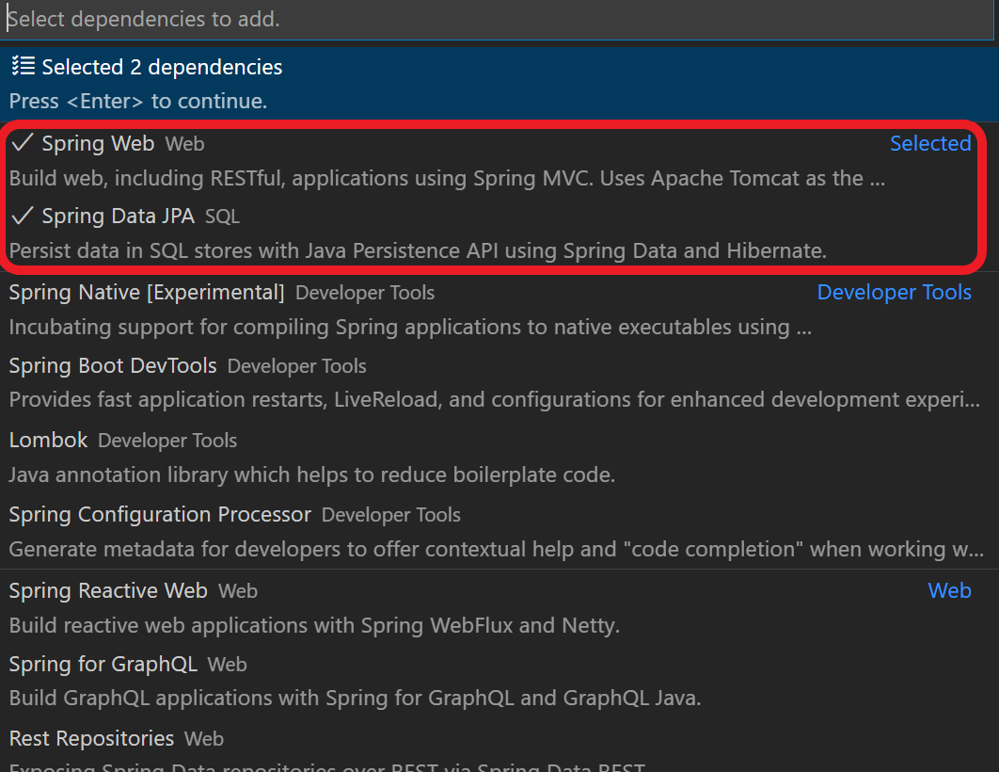

# Overview of the code

In this project, we will access to PostgreSQL from a Spring Boot application.
You need implement and configure the project with following procedure.

1. Create and configure a Spring Boot Project, including a dependency for Postgresql JDBC driver
2. Add dependency for JDBC Passwordless Azure Spring starter. This dependency will enhance the connection string to use an authentication plugin that will not require credentials and will use Azure Default Credentials. In the developer box it could be azure cli credentials, Visual Studio Code credentials or IntelliJ credentials. Later will be explained how to run the sample locally in the developer environment.
3. Create a couple of Jpa repositories for the database. Spring Boot will configure the connection using the convention configuration.
4. Create a service that uses the repositories
5. Create an RESTful endpoint that uses the service
6. Access to the RESTful Endpoint

### 1. Create and configure a Spring Boot project

The project template can be generated using Spring Initialzr and including the following dependencies:

* org.springframework.boot:spring-boot-starter-web
* org.springframework.boot:spring-boot-starter-data-jpa



The pom.xml file dependencies will look like this:

```xml
<dependency>
 <groupId>org.springframework.boot</groupId>
 <artifactId>spring-boot-starter-data-jpa</artifactId>
</dependency>
<dependency>
 <groupId>org.springframework.boot</groupId>
 <artifactId>spring-boot-starter-web</artifactId>
</dependency>
```

If war packaging is selected, the Initializr will also include the following dependency:

* org.springframework.boot:spring-boot-starter-tomcat

```xml
<dependency>
 <groupId>org.springframework.boot</groupId>
 <artifactId>spring-boot-starter-tomcat</artifactId>
<scope>provided</scope>
</dependency>
```

### 2. Add dependency for Azure Cloud JDBC for PostgreSQL Spring starter

```xml
<!--Passwordless spring starter for postgresql -->
<dependency>
	<groupId>com.azure.spring</groupId>
	<artifactId>spring-cloud-azure-starter-jdbc-postgresql</artifactId>
	<version>4.5.0</version>
</dependency>
```

### 3. Create Jpa Repositories

This project includes the following Entities:

* [Checklist](./src/main/java/com/microsoft/azure/samples/springcredentialfree/model/Checklist.java). This entity represents a checklist that can contain CheckItems.
* [CheckItem](./src/main/java/com/microsoft/azure/samples/springcredentialfree/model/Checklist.java).

A JPA repository is created for each entity.

```java
public interface CheckListRepository extends JpaRepository<Checklist, Long> {
}
```

And

```java
public interface CheckItemRepository extends JpaRepository<CheckItem, Long> {
}
```

For simplicity, the database schema is created automatically by hibernate. For doing this, the following properties are configured in application.yml

```yaml
spring:
    sql:
        init:
            mode: ALWAYS
    jpa:
        database-platform: org.hibernate.dialect.PostgreSQLDialect
        open-in-view: false
        hibernate:
            ddl-auto: create
```

Keep in mind that with this configuration the data schema will be created on every startup, loosing any saved data. It is not the purpose of this sample to show how to create and modify the schema.

### 4. Crate a service that uses the repositories

The service uses the repositories and exposes some functionality. To decouple the requirements and the implementation, it is created an interface and the implementation.

```java
public interface CheckListService {
    
    Optional<Checklist> findById(Long id);
    
    void deleteById(Long id);

    List<Checklist> findAll();

    Checklist save(Checklist checklist);

    CheckItem addCheckItem(Long checklistId, CheckItem checkItem);
}
```

To register the implementation it is necessary to decorate the class with @Service annotation.

```java
@Service
public class CheckListServiceImpl implements CheckListService {
    
    private final CheckListRepository checkListRepository;
    
    private final CheckItemRepository checkItemRepository;

    public CheckListServiceImpl(CheckListRepository checkListRepository, CheckItemRepository checkItemRepository) {
        this.checkListRepository = checkListRepository;
        this.checkItemRepository = checkItemRepository;
    }

    @Override
    public Optional<Checklist> findById(Long id) {
        return checkListRepository.findById(id);
    }

    @Override
    public void deleteById(Long id) {
        checkListRepository.deleteById(id);

    }

    @Override
    public List<Checklist> findAll() {
        return checkListRepository.findAll();
    }

    @Override
    public Checklist save(Checklist checklist) {
        return checkListRepository.save(checklist);
    }

    @Override
    public CheckItem addCheckItem(Long checklistId, CheckItem checkItem) {
        Checklist checkList = checkListRepository.findById(checklistId)
                .orElseThrow(() -> new ResourceNotFoundException("Checklist " + checklistId + " not found"));
        checkItem.setCheckList(checkList);
        return checkItemRepository.save(checkItem);
    }
}
```

### 5. Create an RESTful endpoint that uses the service

A simple Rest endpoint that uses the service. The service is automatically injected by Spring Boot in the constructor.

```java
@RequestMapping("/checklist")
@RestController
public class ChecklistResource {
    private final CheckListService checkListService;

    public ChecklistResource(CheckListService checklistService) {
        this.checkListService = checklistService;

    }

    @GetMapping
    public List<Checklist> getCheckLists() {
        return checkListService.findAll();
    }

    @GetMapping("{checklistId}")
    public Checklist getCheckList(@PathVariable(value = "checklistId") Long checklistId) {
        return checkListService.findById(checklistId)
                .orElseThrow(() -> new ResourceNotFoundException("checklist  " + checklistId + " not found"));
    }

    @PostMapping
    @ResponseStatus(HttpStatus.CREATED)
    public Checklist createCheckList(@RequestBody Checklist checklist) {
        return checkListService.save(checklist);
    }

    @PostMapping("{checklistId}/item")
    @ResponseStatus(HttpStatus.CREATED)
    public CheckItem addCheckItem(@PathVariable(value = "checklistId") Long checklistId,
            @RequestBody CheckItem checkItem) {
        return checkListService.addCheckItem(checklistId, checkItem);
    }
}
```

### 9. Access to the RESTful Endpoint

The checklist resource is exposed in _/checklist_ path. So you can test it by executing the following command.

```bash
curl https://[your app service].azurewebsites.net/checklist
[{"date":"2022-03-21T00:00:00","description":"oekd list","id":1,"name":"hajshd"},{"date":"2022-03-21T00:00:00","description":"oekd list","id":2,"name":"hajshd"},{"date":"2022-03-21T00:00:00","description":"oekd list","id":3,"name":"hajshd"}]
```

or the following if using Azure Spring Apps

```bash
curl https://[your spring app service]-[your app name].azuremicroservices.io/checklist
[{"date":"2022-03-21T00:00:00","description":"oekd list","id":1,"name":"hajshd"},{"date":"2022-03-21T00:00:00","description":"oekd list","id":2,"name":"hajshd"},{"date":"2022-03-21T00:00:00","description":"oekd list","id":3,"name":"hajshd"}]
```

As part of this sample, it is provided a [postman collection](./postman/check_lists_request.postman_collection.json) which you can use to test the RESTful API. Just change _appUrl_ variable by your Azure application hosting URL.

## Local development

During the setup of the infrastructure, the current logged-in user in Azure cli was added as PostgreSQL Azure AD administrator. For production workloads it is recommended using a different user with "least privilege approach".

```yaml
spring:
    datasource:
        url: jdbc:postgresql://[YOUR DATABASE HOST].postgres.database.azure.com:5432/checklist
        username: [YOUR LOGGED IN USER]
```

For instance, if you plan to use your Azure cli user, myuser@mydomain.onmicrosoft.com, and your PostgreSQL database host is passwordless-psql. Then your application.yml file should look like this:

```yaml
spring:
    datasource:
        url: jdbc:postgresql://passwordless-psql.postgres.database.azure.com:5432/checklist
        username: myuser@mydomain.onmicrosoft.com
``` 

As you can see, the username is composed by the Azure AD user and the PostgreSQL database host and it has two @ symbols.
