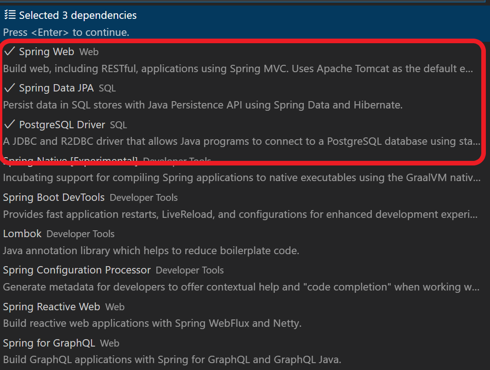

# Access Azure Database for PostgreSQL using Managed Identities for Spring Boot applications

In this sample, you can learn how to configure a Spring Boot application to use Azure Database for PostgreSQL using Managed Identities. This sample includes the steps to deploy the application in:

* Azure App Service on Tomcat using WAR packaging
* Azure App Service on Java SE using JAR packaging
* Azure Spring Apps using JAR packaging

### Prerequire for this sample

* Java SE 8 (or 11)
* Azure CLI command
* Azure Subscription
* git command
* Maven command
* psql client
* Bash
* pwgen as password generator

All samples were developed and tested using Visual Studio Code on WSL2 (Windows Subsystem for Linux 2). Some tools can be different depending on your OS.

## Azure Setup

The following steps are required to setup an Azure Database for PostgreSQL and configure the application to access a database using a managed identity. All the steps can be performed in Azure CLI
For simplicity there are some variables defined.

```bash
RESOURCE_GROUP=[YOUR RESOURCE GROUP]
POSTGRESQL_HOST=[YOUR POSTGRESQL HOST] 
DATABASE_NAME=checklist
DATABASE_FQDN=${POSTGRESQL_HOST}.postgres.database.azure.com
# Note that the connection url does not includes the password-free authentication plugin
# The configuration is injected by spring-cloud-azure-starter-jdbc
POSTGRESQL_CONNECTION_URL="jdbc:postgresql://${DATABASE_FQDN}:5432/${DATABASE_NAME}"
LOCATION=[YOUR PREFERRED LOCATION]
POSTGRESQL_ADMIN_USER=azureuser
APPSERVICE_LOGIN_NAME='checklistapp'
```

Depending if the hosting environment is Azure App Services or Azure Spring Apps there can be some differences.

For Azure App Services, the following variables are defined:

```bash
APPSERVICE_NAME=[YOUR APPSERVICE NAME]
APPSERVICE_PLAN=[YOUR APPSERVICE PLAN NAME]
```

For Azure Spring Apps:

```bash
APPSERVICE_NAME=[YOUR APPLICATION NAME]
SPRING_APPS_SERVICE=[YOUR SPRING APPS SERVICE NAME]
```

### login to your subscription

```bash
az login
```

### create a resource group

```bash
# create resource group
az group create --name $RESOURCE_GROUP --location $LOCATION
```

### create PostgreSQL server

It is created with an administrator account, but it won't be used as it wil be used the Azure AD admin account to perform the administrative tasks.

```bash
POSTGRESQL_ADMIN_USER=azureuser
# Generating a random password for the PostgreSQL admin user as it is mandatory
# postgres admin won't be used as Azure AD authentication is leveraged also for administering the database
POSTGRESQL_ADMIN_PASSWORD=$(pwgen -s 15 1)
# create postgresql server
az postgres server create \
    --name $POSTGRESQL_HOST \
    --resource-group $RESOURCE_GROUP \
    --location $LOCATION \
    --admin-user $POSTGRESQL_ADMIN_USER \
    --admin-password $POSTGRESQL_ADMIN_PASSWORD \
    --public-network-access 0.0.0.0 \
    --sku-name B_Gen5_1 
```

When creating PostgreSQL server, it is necessary to create an Azure AD administrator account to enable Azure AD authentication. The current azure cli user will be configured as Azure AD administrator account.

To get the current user required data:

```bash
CURRENT_USER=$(az account show --query user.name -o tsv)
CURRENT_USER_OBJECTID=$(az ad user show --id $CURRENT_USER --query id -o tsv)
```

Also note the current user domain

```bash
CURRENT_USER_DOMAIN=$(cut -d '@' -f2 <<< $CURRENT_USER)
```

Then, create the Azure AD administrator account:

```bash
# create postgres server AAD admin user
az postgres server ad-admin create --server-name $POSTGRESQL_HOST --resource-group $RESOURCE_GROUP --object-id $CURRENT_USER_OBJECTID --display-name $CURRENT_USER
```

Create a database for the application

```bash
# create postgres database
az postgres db create -g $RESOURCE_GROUP -s $POSTGRESQL_HOST -n $DATABASE_NAME
```

### Create the hosting environment

As mentioned above, the hosting environment can be Azure App Services or Azure Spring Apps.

#### Create application service

When creating the application service, it is specified to use a system managed identity.

```bash
# Create app service plan
az appservice plan create --name $APPSERVICE_PLAN --resource-group $RESOURCE_GROUP --location $LOCATION --sku B1 --is-linux
# Create application service
az webapp create --name $APPSERVICE_NAME --resource-group $RESOURCE_GROUP --plan $APPSERVICE_PLAN --runtime "TOMCAT:9.0-jre8" --assign-identity [system]
```

The authentication plugin is also compatible with User Assigned managed identity, it requires to include the clientId of the managed identity in the JDBC url as parameter _clientid_. So the connection url would be changed to the following.

#### Service connection creation

Service connection with managed identities is not yet supported for App Services. All required steps will be performed manually. To summarize, the steps are:

1. Create a temporary firewall rule to allow access to the mysql server. Postgres server was configured to allow only other Azure services to access it. To allow the deployment box to perform action on Postgres it is necessary to open a connection. After all actions are performed it will be deleted.
1. Get the App Service identity. Postgres requires the clientId/applicationId, and az webapp returns the objectId, so it is necessary to perform an additional request to Azure AD to get the clientId.
1. Create a Postgresql user for the application identity and grant permissions to the database. For this action, it is necessary to connect to the database, for instance using _psql_ client tool. The current user, an Azure AD admin configured above, will be used to connect to the database. `az account get-access-token` can be used to get an access token. As the access is too long to be used as password, it is necessary to save it in PGPASSWORD environment variable. See [Postgresql environment variables](https://www.postgresql.org/docs/current/libpq-envars.html).
1. Remove the temporary firewall rule.

```bash
# 0. Create a temporary firewall rule to allow connections from current machine to the postgres server
MY_IP=$(curl http://whatismyip.akamai.com)
az postgres server firewall-rule create --resource-group $RESOURCE_GROUP --server $POSTGRESQL_HOST --name AllowCurrentMachineToConnect --start-ip-address ${MY_IP} --end-ip-address ${MY_IP}
# 1. Get web application managed identity
APPSERVICE_IDENTITY_OBJID=$(az webapp show --name $APPSERVICE_NAME --resource-group $RESOURCE_GROUP --query identity.principalId -o tsv)
# 2. IMPORTANT: It is required the clientId/appId, and previous command returns object id. So next step retrieve the client id
APPSERVICE_IDENTITY_APPID=$(az ad sp show --id $APPSERVICE_IDENTITY_OBJID --query appId -o tsv)
# 3. Create postgres user in the database and grant permissions the database. Note that login is performed using the current logged in user as AAD Admin and using an access token
export PGPASSWORD=$(az account get-access-token --resource-type oss-rdbms --output tsv --query accessToken)
psql "host=$DATABASE_FQDN port=5432 user=${CURRENT_USER}@${POSTGRESQL_HOST} dbname=${DATABASE_NAME} sslmode=require" << EOF 
SET aad_validate_oids_in_tenant = off;

REVOKE ALL PRIVILEGES ON DATABASE "${DATABASE_NAME}" FROM "${APPSERVICE_LOGIN_NAME}";

DROP USER IF EXISTS "${APPSERVICE_LOGIN_NAME}";
DROP USER IF EXISTS "${APPSERVICE_LOGIN_NAME}@${CURRENT_USER_DOMAIN}";

CREATE ROLE "${APPSERVICE_LOGIN_NAME}" WITH LOGIN PASSWORD '${APPSERVICE_IDENTITY_APPID}' IN ROLE azure_ad_user;

GRANT ALL PRIVILEGES ON DATABASE "${DATABASE_NAME}" TO "${APPSERVICE_LOGIN_NAME}";

EOF

# 4. Remove temporary firewall rule
az postgres server firewall-rule delete --resource-group $RESOURCE_GROUP --server $POSTGRESQL_HOST --name AllowCurrentMachineToConnect
```

#### Deploy the application on App Service

If the application is deployed on Tomcat it is necessary to build a war file, if deployed as JavaSE it is necessary to build a jar file. For that purpose there are two pom.xml files.

* pom.xml generates a jar file
* pom-war.xml generates a war file
The main difference is the packaging type, and for war packaging it is necessary to include the following dependency:

```xml
<!-- Required to deploy WAR on Tomcat -->
<dependency>
 <groupId>org.springframework.boot</groupId>
 <artifactId>spring-boot-starter-tomcat</artifactId>
 <scope>provided</scope>
</dependency>
```

##### Deploy on Tomcat

```bash
# Build WAR file
mvn clean package -f pom-war.xml
# Set environment variables for the web application pointing to the database and using the appservice identity login
az webapp config appsettings set -g $RESOURCE_GROUP -n $APPSERVICE_NAME --settings "SPRING_DATASOURCE_USERNAME=${APPSERVICE_LOGIN_NAME}@${POSTGRESQL_HOST}" "SPRING_DATASOURCE_URL=${POSTGRESQL_CONNECTION_URL}"
# Create webapp deployment
az webapp deploy --resource-group $RESOURCE_GROUP --name $APPSERVICE_NAME --src-path target/app.war --type war
```

##### Deploy on JavaSE

```bash
# Build JAR file
mvn clean package -f pom.xml

# Set environment variables for the web application pointing to the database and using the appservice identity login
az webapp config appsettings set -g $RESOURCE_GROUP -n $APPSERVICE_NAME --settings "SPRING_DATASOURCE_USERNAME=${APPSERVICE_LOGIN_NAME}@${POSTGRESQL_HOST}" "SPRING_DATASOURCE_URL=${POSTGRESQL_CONNECTION_URL}"

# Create webapp deployment
az webapp deploy --resource-group $RESOURCE_GROUP --name $APPSERVICE_NAME --src-path target/app.jar --type jar
```

### Create Azure Spring Apps

In Azure Spring Apps the steps are simpler as it is available the service connection creation. It takes care of assigning a managed identity to the application, create the user in the database, grant permissions and configure the application. So it only requires:

* Create Azure Spring Apps service
* Create an application
* Create a service connection
Then it is only required to deploy the application.

#### Create Azure Spring Apps service

```bash
# Create Spring App service
az spring create --name ${SPRING_APPS_SERVICE} \
    --resource-group ${RESOURCE_GROUP} \
    --location ${LOCATION} \
    --sku Basic
```

#### Create an application

The application will be created with a public endpoint to make it accessible from the internet.

```bash
# Create Application
az spring app create --name ${APPSERVICE_NAME} \
    -s ${SPRING_APPS_SERVICE} \
    -g ${RESOURCE_GROUP} \
    --assign-endpoint true 
```

#### Create a service connection

```bash
# create service connection.The service connection creates the managed identity if not exists.
az spring connection create postgres \
    --resource-group $RESOURCE_GROUP \
    --service $SPRING_APPS_SERVICE \
    --connection demo_connection \
    --app ${APPSERVICE_NAME} \
    --deployment default \
    --tg $RESOURCE_GROUP \
    --server $POSTGRESQL_HOST \
    --database $DATABASE_NAME \
    --client-type springboot
```

#### Build and deploy the application

The application will be deployed as a jar file, so pom.xml is used.

```bash
# Build JAR file
mvn clean package -f pom.xml

# Deploy application
az spring app deploy --name $APPSERVICE_NAME\
    --resource-group $RESOURCE_GROUP \
    --service $SPRING_APPS_SERVICE \
    --artifact-path target/app.jar
```

### All together

It is provided 3 scripts to create and deploy the environment depending on the hosting environment.

* Tomcat on App Service: [deploy-on-tomcat.sh](azure/deploy-on-tomcat.sh)
* Standalone JavaSE on App Service: [deploy-on-javase.sh](azure/deploy-on-javase.sh).
* Azure Spring Apps: [deploy-on-springapp.sh](azure/deploy-on-springapp.sh)

### Clean-up Azure resources

Just delete the resource group where all the resources were created

```bash
az group delete $RESOURCE_GROUP
```

## Overview of the code

In this project, we will access to PostgreSQL from a Spring Boot application.
You need implement and configure the project with following procedure.

1. Create and configure a Spring Boot Project, including a dependency for Postgresql JDBC driver
2. Add dependency for JDBC Credential-free Azure Spring starter. This dependency will enhance the connection string to use an authentication plugin that will not require credentials and will use Azure Default Credentials. In the developer box it could be azure cli credentials, Visual Studio Code credentials or IntelliJ credentials. Later will be explained how to run the sample locally in the developer environment.
3. Create a couple of Jpa repositories for the database. Spring Boot will configure the connection using the convention configuration.
4. Create a service that uses the repositories
5. Create an RESTful endpoint that uses the service
6. Access to the RESTful Endpoint

### 1. Create and configure a Spring Boot project

The project template can be generated using Spring Initialzr and including the following dependencies:

* org.springframework.boot:spring-boot-starter-web
* org.springframework.boot:spring-boot-starter-data-jpa
* org.postgresql:postgresql



The pom.xml file dependencies will look like this:

```xml
<dependency>
 <groupId>org.springframework.boot</groupId>
 <artifactId>spring-boot-starter-data-jpa</artifactId>
</dependency>
<dependency>
 <groupId>org.springframework.boot</groupId>
 <artifactId>spring-boot-starter-web</artifactId>
</dependency>
<dependency>
 <groupId>org.postgresql</groupId>
 <artifactId>postgresql</artifactId>
 <scope>runtime</scope>
</dependency>
```

If war packaging is selected, the Initializr will also include the following dependency:

* org.springframework.boot:spring-boot-starter-tomcat

```xml
<dependency>
 <groupId>org.springframework.boot</groupId>
 <artifactId>spring-boot-starter-tomcat</artifactId>
<scope>provided</scope>
</dependency>
```

### 2. Add dependency for JDBC Credential-free Spring starter

```xml
<dependency>
 <groupId>com.azure.spring</groupId>
 <artifactId>spring-cloud-azure-starter-jdbc</artifactId>
 <version>0.0.1-SNAPSHOT</version>
</dependency>
```

### 3. Create Jpa Repositories

This project includes the following Entities:

* [Checklist](./src/main/java/com/microsoft/azure/samples/springcredentialfree/model/Checklist.java). This entity represents a checklist that can contain CheckItems.
* [CheckItem](./src/main/java/com/microsoft/azure/samples/springcredentialfree/model/Checklist.java).

A JPA repository is created for each entity.

```java
public interface CheckListRepository extends JpaRepository<Checklist, Long> {
}
```

And

```java
public interface CheckItemRepository extends JpaRepository<CheckItem, Long> {
}
```

For simplicity, the database schema is created automatically by hibernate. For doing this, the following properties are configured in application.yml

```yaml
spring:
    sql:
        init:
            mode: ALWAYS
    jpa:
        database-platform: org.hibernate.dialect.PostgreSQLDialect
        open-in-view: false
        hibernate:
            ddl-auto: create
```

Keep in mind that with this configuration the data schema will be created on every startup, loosing any saved data. It is not the purpose of this sample to show how to create and modify the schema.

### 4. Crate a service that uses the repositories

The service uses the repositories and exposes some functionality. To decouple the requirements and the implementation, it is created an interface and the implementation.

```java
public interface CheckListService {
    
    Optional<Checklist> findById(Long id);
    
    void deleteById(Long id);

    List<Checklist> findAll();

    Checklist save(Checklist checklist);

    CheckItem addCheckItem(Long checklistId, CheckItem checkItem);
}
```

To register the implementation it is necessary to decorate the class with @Service annotation.

```java
@Service
public class CheckListServiceImpl implements CheckListService {
    
    private final CheckListRepository checkListRepository;
    
    private final CheckItemRepository checkItemRepository;

    public CheckListServiceImpl(CheckListRepository checkListRepository, CheckItemRepository checkItemRepository) {
        this.checkListRepository = checkListRepository;
        this.checkItemRepository = checkItemRepository;
    }

    @Override
    public Optional<Checklist> findById(Long id) {
        return checkListRepository.findById(id);
    }

    @Override
    public void deleteById(Long id) {
        checkListRepository.deleteById(id);

    }

    @Override
    public List<Checklist> findAll() {
        return checkListRepository.findAll();
    }

    @Override
    public Checklist save(Checklist checklist) {
        return checkListRepository.save(checklist);
    }

    @Override
    public CheckItem addCheckItem(Long checklistId, CheckItem checkItem) {
        Checklist checkList = checkListRepository.findById(checklistId)
                .orElseThrow(() -> new ResourceNotFoundException("Checklist " + checklistId + " not found"));
        checkItem.setCheckList(checkList);
        return checkItemRepository.save(checkItem);
    }
}
```

### 5. Create an RESTful endpoint that uses the service

A simple Rest endpoint that uses the service. The service is automatically injected by Spring Boot in the constructor.

```java
@RequestMapping("/checklist")
@RestController
public class ChecklistResource {
    private final CheckListService checkListService;

    public ChecklistResource(CheckListService checklistService) {
        this.checkListService = checklistService;

    }

    @GetMapping
    public List<Checklist> getCheckLists() {
        return checkListService.findAll();
    }

    @GetMapping("{checklistId}")
    public Checklist getCheckList(@PathVariable(value = "checklistId") Long checklistId) {
        return checkListService.findById(checklistId)
                .orElseThrow(() -> new ResourceNotFoundException("checklist  " + checklistId + " not found"));
    }

    @PostMapping
    @ResponseStatus(HttpStatus.CREATED)
    public Checklist createCheckList(@RequestBody Checklist checklist) {
        return checkListService.save(checklist);
    }

    @PostMapping("{checklistId}/item")
    @ResponseStatus(HttpStatus.CREATED)
    public CheckItem addCheckItem(@PathVariable(value = "checklistId") Long checklistId,
            @RequestBody CheckItem checkItem) {
        return checkListService.addCheckItem(checklistId, checkItem);
    }
}
```

### 9. Access to the RESTful Endpoint

The checklist resource is exposed in _/checklist_ path. So you can test it by executing the following command.

```bash
curl https://[your app service].azurewebsites.net/checklist
[{"date":"2022-03-21T00:00:00","description":"oekd list","id":1,"name":"hajshd"},{"date":"2022-03-21T00:00:00","description":"oekd list","id":2,"name":"hajshd"},{"date":"2022-03-21T00:00:00","description":"oekd list","id":3,"name":"hajshd"}]
```

or the following if using Azure Spring Apps

```bash
curl https://[your spring app service]-[your app name].azuremicroservices.io/checklist
[{"date":"2022-03-21T00:00:00","description":"oekd list","id":1,"name":"hajshd"},{"date":"2022-03-21T00:00:00","description":"oekd list","id":2,"name":"hajshd"},{"date":"2022-03-21T00:00:00","description":"oekd list","id":3,"name":"hajshd"}]
```

As part of this sample, it is provided a [postman collection](./postman/check_lists_request.postman_collection.json) which you can use to test the RESTful API. Just change _appUrl_ variable by your Azure application hosting URL.

## Local development

During the setup of the infrastructure, the current logged-in user in Azure cli was added as PostgreSQL Azure AD administrator. For production workloads it is recommended using a different user with "least privilege approach".

```yaml
spring:
    datasource:
        url: jdbc:postgresql://[YOUR DATABASE HOST].postgres.database.azure.com:5432/checklist
        username: [YOUR LOGGED IN USER]@[YOUR DATABASE HOST]
```

For instance, if you plan to use your Azure cli user, myuser@mydomain.onmicrosoft.com, and your PostgreSQL database host is credential-free-psql. Then your application.yml file should look like this:

```yaml
spring:
    datasource:
        url: jdbc:postgresql://credential-free-psql.postgres.database.azure.com:5432/checklist
        username: myuser@mydomain.onmicrosoft.com@credential-free-psql
``` 

As you can see, the username is composed by the Azure AD user and the PostgreSQL database host and it has two @ symbols.
